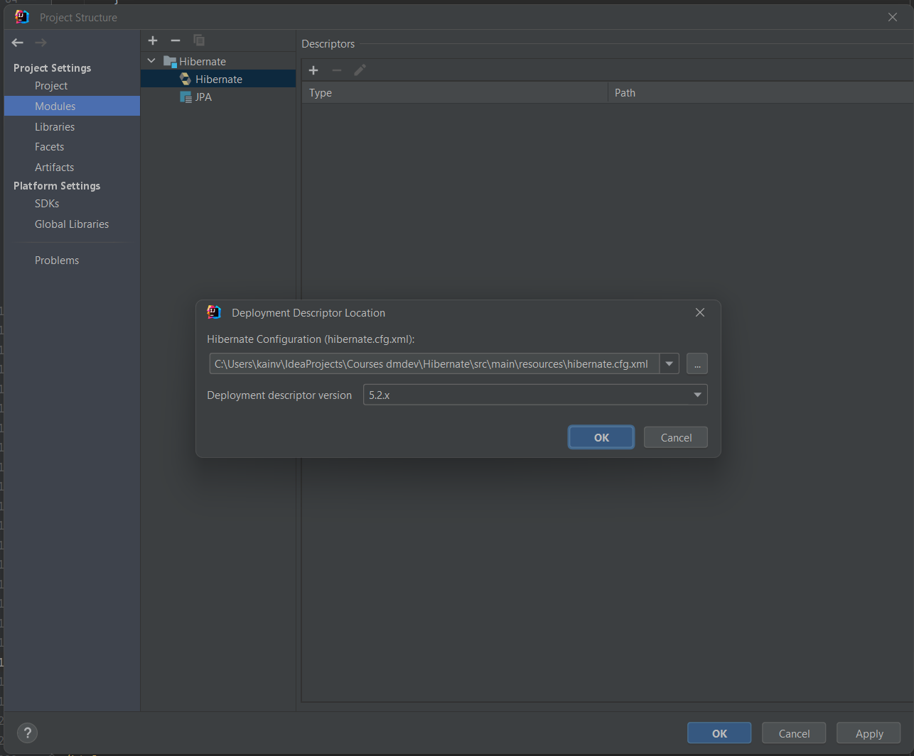
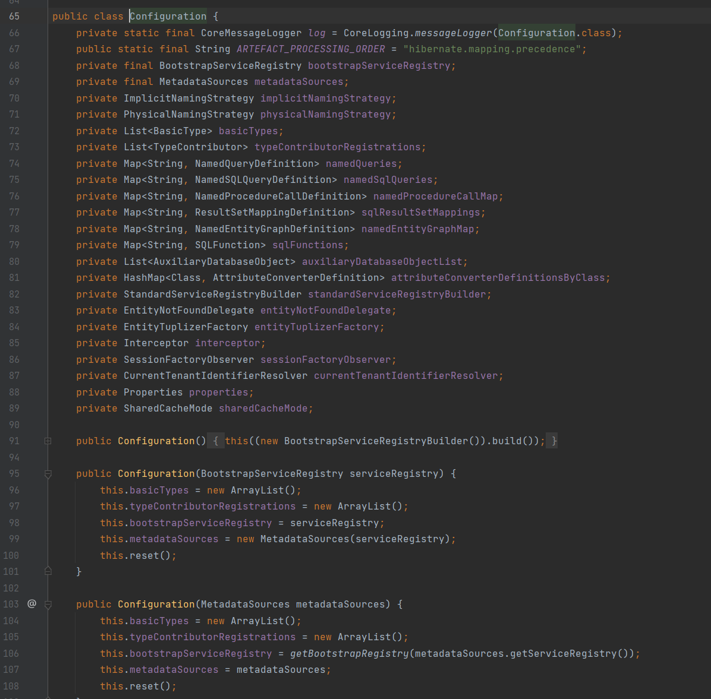
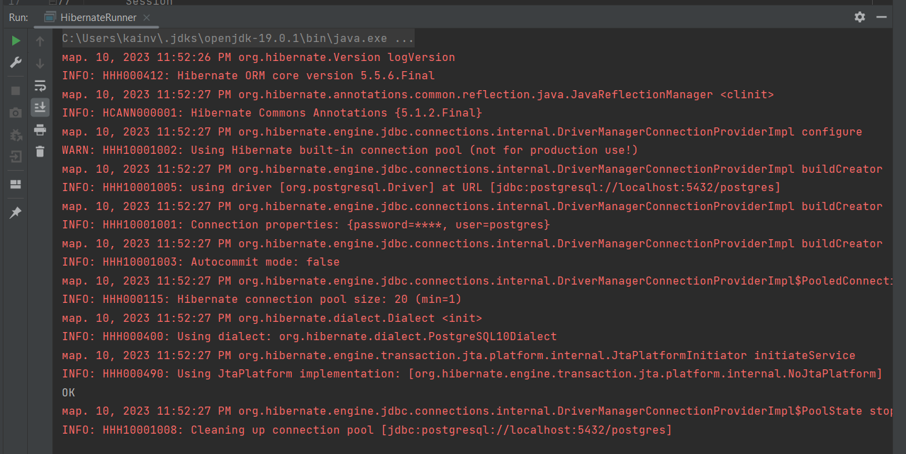

004 Конфигурация SessionFactory
===============================

Начнём изучения с того, что уже знает - JDBC. Создадим класс `HibernateRunner`.

    package com.kainv;

    import java.sql.Connection;
    import java.sql.DriverManager;
    import java.sql.SQLException;

    public class HibernateRunner {
        public static void main(String\[\] args) throws SQLException {
            Connection connection = DriverManager
                    .getConnection("jdbc:postgresql://localhost:5432/postgres", "postgres", "postgres");

        }
    }

В зависимости от того, где разворачивали приложение - могут различаться url, user & password. Следовательно, мы брали эти настройки и выносили в отдельный файл. Т.е. в properties файл. Создадим application.properties и занесём туда данные:

**application.properties**

    db.url=jdbc:postgresql://localhost:5432/postgres
    db.username=postgres
    db.password=postgres

Таким образом зависимости от того, где разворачиваем наше приложение - мы просто меняли эти настройки, а в коде где обращались к url, юзернейм и пароль - просто получали по ключам из наших properties.

    public class HibernateRunner {
        public static void main(String\[\] args) throws SQLException {
            Connection connection = DriverManager
                    .getConnection("db.url", "db.username", "db.password");
    
        }
    }

Таким образом и поступают в реальных приложениях. Всё изменяемое и конфигурируемое выносят в какие-то текстовые файлы которые не нужно перекомпилировать.

Но этого было недостаточно, мы создавали пул соединений потому что в реальных приложениях достаточно небольшого пула на 10-20 соединений потому что создание объекта Connection дорогостояще и трудозатратно. Поэтому была потокобезопасная очередь соединений:

    public class HibernateRunner {
        public static void main(String\[\] args) throws SQLException {
            BlockingQueue<Connection> pool = null;
    //        Connection connection = pool.take();
            Connection connection = DriverManager
                    .getConnection("db.url", "db.username", "db.password");
    
        }
    }

В **hibernate** всё по сложнее. Там мы так же спускаемся до JDBC, пулом и Connection'ов, но все оборачивается в соответствующие hibernate-классы. В случае Connection это будет объект `Session`, а в случае нашего pool'а (т.е. объекта у которого будем получать объекты типа `Session`) это был `SessionFactory`. И наша задача - просто проинициализировать `SessionFactory` и из него мы можем спокойно получать `Session` и спокойно оперировать нашими сущностями.

Для этого нам необходим конфигурационный файл, аналог _application.properties_ только в случае hibernate это будет _hibernate.cfg.xml_ и лежать будет в каталоге _resources_.

 **hibernate.cfg.xml**

    <?xml version='1.0' encoding='utf-8'?>
            <!DOCTYPE hibernate-configuration PUBLIC
        "-//Hibernate/Hibernate Configuration DTD//EN"
        "http://www.hibernate.org/dtd/hibernate-configuration-3.0.dtd">
    <hibernate-configuration>
      <session-factory>
        <property name="connection.url"/>
        <property name="connection.driver\_class"/>
          <!-- <property name="connection.username"/> -->
          <!-- <property name="connection.password"/> -->
    
          <!-- DB schema will be updated if needed -->
          <!-- <property name="hibernate.hbm2ddl.auto">update</property> -->
      </session-factory>
    </hibernate-configuration>

Этот файл может лежать в любых других директориях, но обычно лежит в ROOT'овой директории resources. Главная задача этого конфигурационного файла - это создать нам объект `SessionFactory` с соответствующими полями:

    <?xml version='1.0' encoding='utf-8'?>
            <!DOCTYPE hibernate-configuration PUBLIC
            "-//Hibernate/Hibernate Configuration DTD//EN"
            "http://www.hibernate.org/dtd/hibernate-configuration-3.0.dtd">
    <hibernate-configuration>
        <session-factory>
            <property name="connection.url">jdbc:postgresql://localhost:5432/postgres</property>
            <property name="connection.username">postgres</property>
            <property name="connection.password">postgres</property>
            <property name="connection.driver\_class">org.postgresql.Driver</property>
            <!--        Указываем диалект -->
            <property name="hibernate.dialect">org.hibernate.dialect.PostgreSQL10Dialect</property>
    
            <!-- DB schema will be updated if needed -->
            <!-- <property name="hibernate.hbm2ddl.auto">update</property> -->
        </session-factory>
    </hibernate-configuration>

Мы тут будем ещё другие пропертисы настраивать, но пока на этом этапе этого будет достаточно. Диалект Позволяет hibernate сконфигурировать дополнительно какие-то SQL типы либо ф-ции, view которые специфичны для конкретной БД. PostgreSQL10Dialect говорит о том, что будет диалект psql 10 и выше. Сам этот класс наследуется от предыдущей версии.

Создадим SessionFactory в HibernateRunner.java
----------------------------------------------

Для этого есть специальный класс `Configuration` и у этого класса есть метод `configure()` который может принимать путь к _hibernate.cfg.xml_. Если его не указывать, то будет по умолчанию искать в ROOT'овой директории ресурсов. Если бы лежал в какой-нибудь другой директории, то указали бы явно `configuration.configure("path/to/cgf.xml")`, но в нашем случае мы можем это опустить.

    public class HibernateRunner {
        public static void main(String\[\] args) throws SQLException {
    //        BlockingQueue<Connection> pool = null;
    //        Connection connection = pool.take();
    //        SessionFactory
    
    //        Connection connection = DriverManager
    //                .getConnection("db.url", "db.username", "db.password");
    //        Session
    
            Configuration configuration = new Configuration();
            configuration.configure();
        }
    }

**Что же это за класс Configuration?** В нём находится все нужное для создания `SessionFactory`. Т.е. например очень много всего, что связано со стратегией именования, которые указывают, как преобразуем название классов в java в соответствующее название таблиц, колонок в БД. Какие у нас есть типы, которые поддерживаем, различные именованные Queries, процедуры, sqlFunctions и многое другое. Так же есть много свойств которые созданы для того чтобы как раз таки использовать для создания нашей `SessionFactory`. Это все можем установить вручную, но по умолчанию все эти настройки нас будут более чем устраивать. А всё что будет связано с метаинформацией, то есть с нашими таблицами, то для этого есть специальный класс `MetadataSources`.

В БД мета-информация это структура каталогов, схем, таблиц, колонок и прочее. Для этого у нас есть `MetadataSources` в нашем классе `Configuration`.

Теперь у объекта типа `configuration` вызываем метод `buildSessionFactory()`, который возвращает `SessionFactory` на основании всех полей в классе `Configuration` и + cfg.xml. Как и ConnectionPool - должен существовать всего лишь один объект типа `SessionFactory` на все приложение.

У `SessionFactory` мы можем получить `Session`, которая является что-то вроде обертки вокруг нашего соединения, который просто предоставляет гораздо больший функционал необходимый для hibernate и для управления его сущностями.

    public class HibernateRunner {
        public static void main(String\[\] args) throws SQLException {
    //        BlockingQueue<Connection> pool = null;
    //        Connection connection = pool.take();
    //        SessionFactory
    
    //        Connection connection = DriverManager
    //                .getConnection("db.url", "db.username", "db.password");
    //        Session
    
            Configuration configuration = new Configuration();
            configuration.configure();
    
            try (
                    SessionFactory sessionFactory = configuration.buildSessionFactory();
                    Session session = sessionFactory.openSession()
            ) {
                System.out.println("OK");
            }
        }
    }

Запустим чтобы проверить, что все сработало:

`SessionFactory` и `Session` создались.