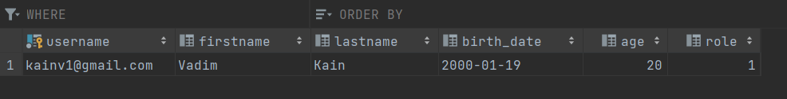
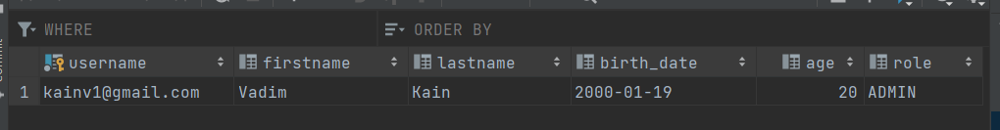

007 Type converters
===================

Если обратимся к курсу JDBC, где устанавливали определенные типы данных для PreparedStatement, то в случае когда он не соответствовал (например был маппинг соответствующих внешних ключей) - мы извлекали id. В другом случае из TimeStamp преобразовывали в LocalDateTime. В случае сложных сущностей мы обращались к соответствующим Dao и там делали тоже запрос на findById(). **Как Hibernate поступает в таком случае?**

Всё довольно просто. В классе `Configuration` есть поле `private List<BasicType> basicTypes;`. Это список всех типов, которые поддерживает хайбернет и он может преобразовывать один тип в другой. `BasicType` наследуется от `Type`. Это самый главный интерфейс для всех типов в Hibernate. Если посмотрим на все его реализации, то увидим все типы, которые может преобразовывать из одного типа в другой. Следственно, мы **не можем** придумать какой-то свой тип и без какого-то дополнительного написания кода добится того, чтобы хайбернет его преобразовал в соответствующий SQL тип.

Именно благодаря этим типам мы можем также преобразовывать даже сложные маппинги между сущностями.

Если мы хотим написать свой тип данных, то нам нужно всего лишь реализовать интерфейс `Type` или `UserType` - они более облегченные. Как пример, из уже существующих реализованный UserType'ов есть `EnumType`. Их также можно использовать, что позволяет нам создавать любые собственные Enum'ы и он будет их преобразовывать в соответствующий SQL. Например, если создадим класс `enum Role` и в нём будет следующее:

    package com.kainv.entity;

    public enum Role {
        USER, ADMIN
    }

И в `User` добавим соответствующую колонку:

    @Data
    @NoArgsConstructor
    @AllArgsConstructor
    @Builder
    @Entity
    @Table(name = "users", schema = "public")
    public class User {
        @Id
        private String username;
        private String firstname;
        private String lastname;
        @Column(name = "birth\_date")
        private LocalDate birthDate;
        private Integer age;
        private Role role;
    }

Зайдём в SQL и добавим этот role, но как целочисленный тип:

    CREATE TABLE users
    (
        username  VARCHAR(128) PRIMARY KEY,
        firstname VARCHAR(128),
        lastname  VARCHAR(128),
        birt\_date DATE,
        age       INT,
        role      INT
    )

Теперь, в `HibernateRunner` мы можем в нашем пользователе добавить роль ADMIN:

    public class HibernateRunner {
        public static void main(String\[\] args) {
            Configuration configuration = new Configuration();
    //        configuration.setPhysicalNamingStrategy(new CamelCaseToUnderscoresNamingStrategy());
    //        configuration.addAnnotatedClass(User.class);
            configuration.configure();

    //        Failed to resolve org.junit.platform:junit-platform-launcher:1.7.2

    //        11:33

            try (
                    SessionFactory sessionFactory = configuration.buildSessionFactory();
                    Session session = sessionFactory.openSession()
            ) {
                session.beginTransaction();

                User user = User.builder()
                        .username("kainv1@gmail.com")
                        .firstname("Vadim")
                        .lastname("Kain")
                        .birthDate(LocalDate.of(2000, 1, 19))
                        .age(20)
                        .role(Role.ADMIN)
                        .build();

                session.save(user);

                session.getTransaction().commit();
            }
        }
    }

Запустим и посмотрим что получится:

Видим 1, это ordinal нашего enum'а ADMIN. Ordinal нехорошо исиользовать поскольку если изменится порядок enum'ов, то это не будет работать, в БД придется делать update. Следовательно, в этой ситуации лучше делать строковое представление:

    CREATE TABLE users
    (
        username  VARCHAR(128) PRIMARY KEY,
        firstname VARCHAR(128),
        lastname  VARCHAR(128),
        birth\_date DATE,
        age       INT,
        role      VARCHAR(32)
    );

Для того чтобы по умолчанию убрать использование ordinal, а использовать строковое представление (т.е. наш name), то для этого есть соответствующая аннотация `@Enumerated`, в которую передаём `EnumType.ORDINAL/STRING`:

    @Data
    @NoArgsConstructor
    @AllArgsConstructor
    @Builder
    @Entity
    @Table(name = "users", schema = "public")
    public class User {
        @Id
        private String username;
        private String firstname;
        private String lastname;
        @Column(name = "birth\_date")
        private LocalDate birthDate;
        private Integer age;
        @Enumerated(EnumType.STRING)
        private Role role;
    }

Запускаем HibernateRunner и видим результат:

