014 Entity lifecycle. Практика
==============================

На практике посмотрим в какой момент времени та или иная сущность находится в одном из этих четырех состояний.

Для начала приведём наш код в порядок. Т.е. удалим сессии наши. Мы их создадим две. Т.е. у нас будет одна сессия и как обычно открываем и закрываем транзакцию (обязательно) и то же самое со второй сессией. Вынесем наш `Configuration` в отдельный метод потому что мы будем использовать его в наших тестах (вынесем в _util/HibernateUtil.java_:

**HibernateUtil.java**

    package com.kainv.util;

    import com.kainv.converter.BirthdayConverter;
    import com.vladmihalcea.hibernate.type.json.JsonBinaryType;
    import lombok.experimental.UtilityClass;
    import org.hibernate.SessionFactory;
    import org.hibernate.cfg.Configuration;

    @UtilityClass
    public class HibernateUtil {
        public static SessionFactory buildSessionFactory() {
            Configuration configuration = new Configuration();
    //        configuration.setPhysicalNamingStrategy(new CamelCaseToUnderscoresNamingStrategy());
    //        configuration.addAnnotatedClass(User.class);
            configuration.addAttributeConverter(new BirthdayConverter());
            configuration.registerTypeOverride(new JsonBinaryType());
            configuration.configure();

            return configuration.buildSessionFactory();
        }
    }

**HibernateRunner.java**

    package com.kainv;

    import com.kainv.util.HibernateUtil;
    import org.hibernate.Session;
    import org.hibernate.SessionFactory;

    public class HibernateRunner {
        public static void main(String\[\] args) {
            try (SessionFactory sessionFactory = HibernateUtil.buildSessionFactory()) {
                try (Session session1 = sessionFactory.openSession()) {
                    session1.beginTransaction();

                    session1.getTransaction().commit();
                }

                try (Session session2 = sessionFactory.openSession()) {
                    session2.beginTransaction();

                    session2.getTransaction().commit();
                }

            }
        }
    }

Теперь создадим нашего User:

    public class HibernateRunner {
        public static void main(String\[\] args) {
            User user = User.builder()
                    .username("kain@gmail.com")
                    .lastname("Kain")
                    .firstname("Vadim")
                    .build();

            try (SessionFactory sessionFactory = HibernateUtil.buildSessionFactory()) {
                try (Session session1 = sessionFactory.openSession()) {
                    session1.beginTransaction();

                    session1.getTransaction().commit();
                }

                try (Session session2 = sessionFactory.openSession()) {
                    session2.beginTransaction();

                    session2.getTransaction().commit();
                }

            }
        }
    }

Мы сейчас создали нашу сущность и она ни с какой сессией не связана. Т.е. наш user находится в состоянии **Transient** по отношению к любой из этих сессий.

В session1 сделаем `session1.saveOrUpdate(user);`. В этой точке наш пользователь уже будет в **Persistent** состоянии по отношению к session1, но все ещё в состоянии **Transient** по отношению к session2 потому что он не был никогда проассоциирован с этой второй сессией. В дебаге запустим и посмотрим что у нас будет:

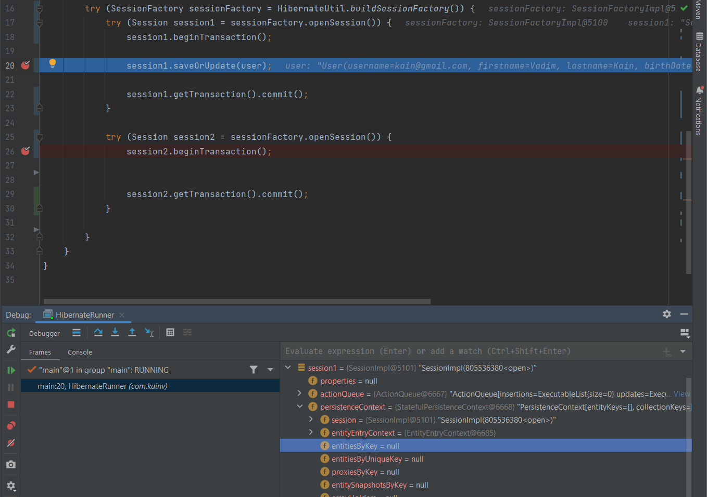

Видим, что пользователь ещё **Transient** по отношению к session1. Далее, как только вызываем метод наш юзер добавится в кэш:

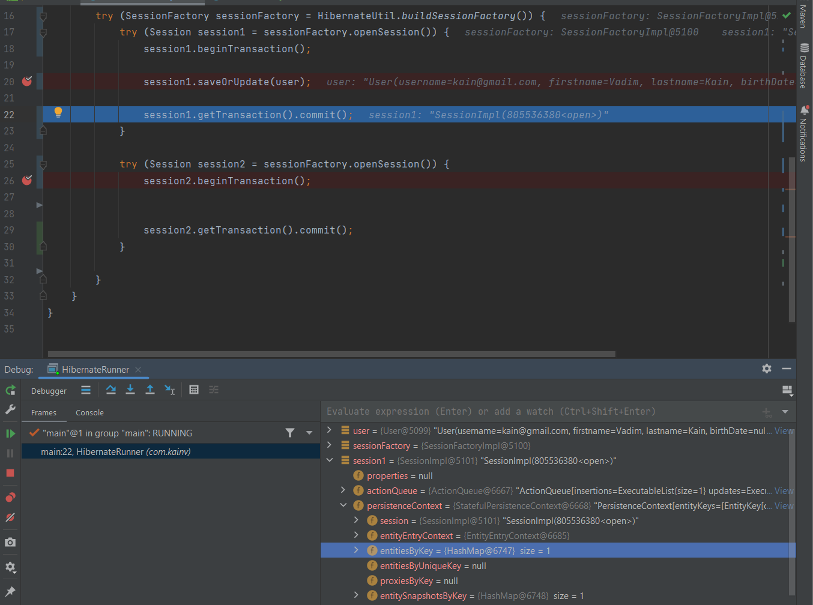

Теперь он находится в **Persistent** состоянии. Делаем коммит и видим, что в консоли вызвались все соответствующие SQL запросы:

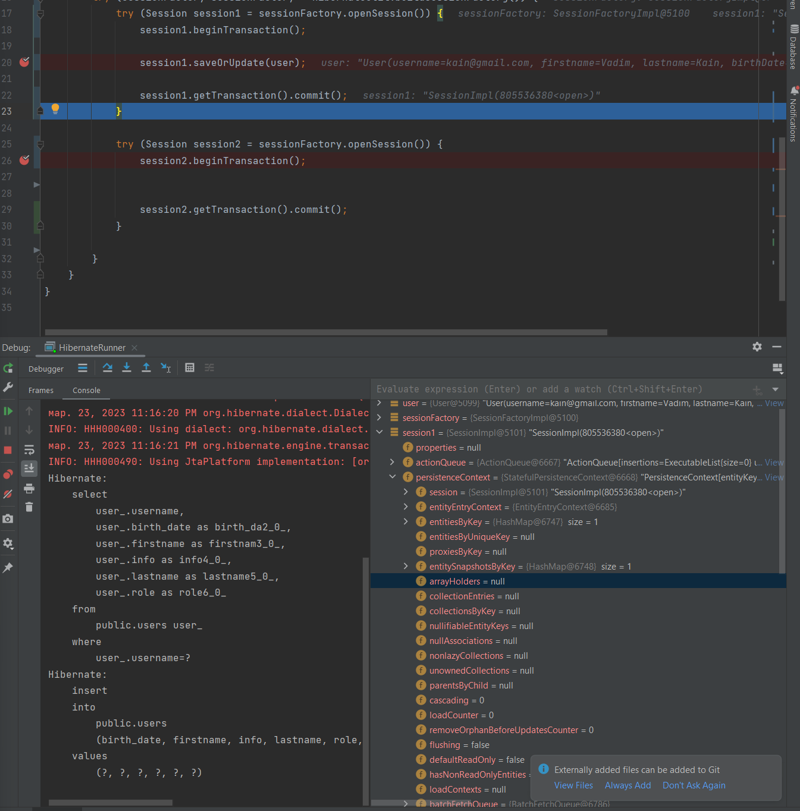

Вызвался select, чтобы проассоциировать нашу сущность user с сессией (как мы обсуждали - мы обязаны делать либо select, либо save, для того чтобы синхронизироваться с базой данных и только в таком случае мы добавляем это все в кэш сессии). Далее делаем update.

Идём дальше, закрываем нашу session1 и следственно, user в **Detached** состоянии по соотношению к session1. В принципе session1 уже не существует, но если бы она была и мы вызвали метод close, то сущность была бы в состоянии **Detached** по отношению к session1, но всё ещё в состоянии **Transient** по отношению к session2.

Далее заходим в session2 и в дебаге мы видим, что есть ссылка на session2 и здесь `entitiesByKey = null` (кэш пустой). Поэтому очень важно понимать, что сущность имеет какое-то состояние по отношению к какой-то конкретной сессии потому что сессий может быть много. У нас целый пулл этих сессий в нашей `SessionFactory` и у каждой из этих сессий есть свой кэш.

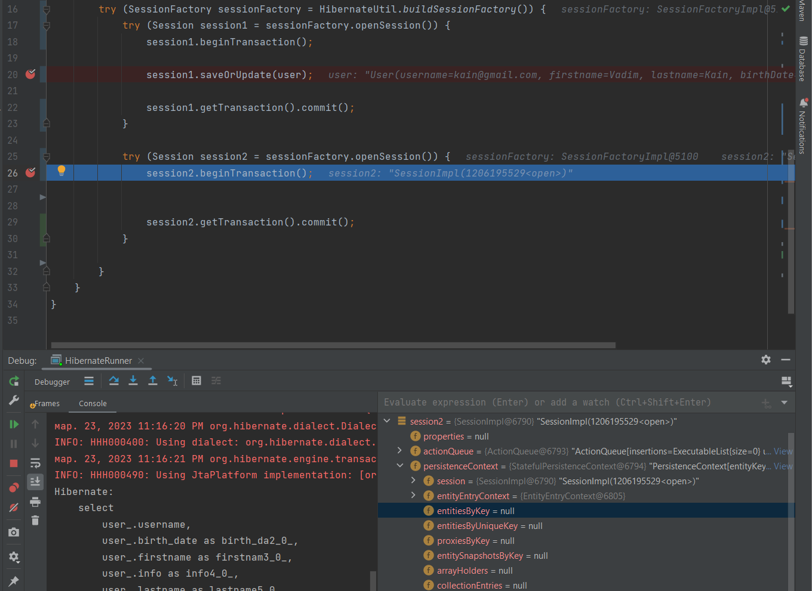

Но если мы захотим удалить сущность, т.е. сделать `session2.delete(user);`, то как мы видели - сначала произойдёт `session2.get()` метод для того чтобы проассоциировать нашего юзера с сессией, а только потом произойдёт delete потому что delete это метод который переводит состояние нашей сущности из **Persistent** в **Removed**. Попробуем вызвать этот метод:

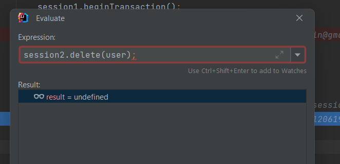

undefined, но мы видим что после того как вызвали метод - у нас появился в кэше session2 сущность:

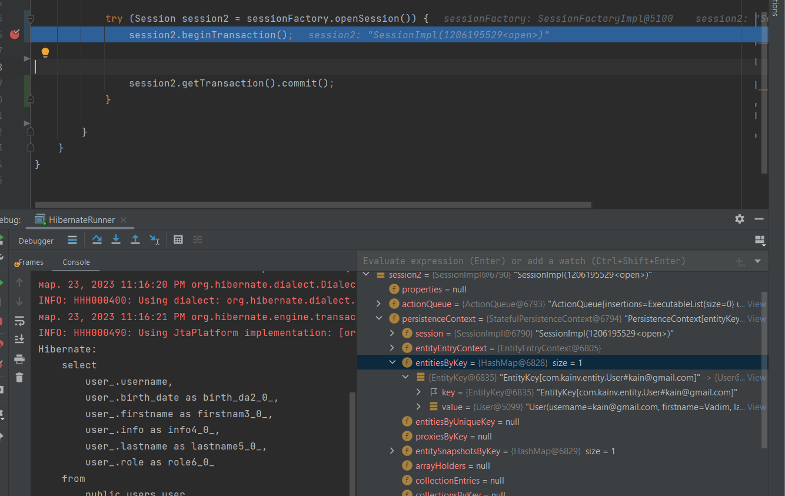

Как только мы дойдем до момента где коммитим транзакцию произойдёт вызов метода SQL delete и наша сущность переходит в состояние **Removed** по отношению к session2.

Как видим, все вертится вокруг `PersistenceContext`, т.е. нашего first level cache.

Рассмотрим ещё два интересных метода
------------------------------------

### Session.refresh(entity)

В блоке session2 изменим firstname для пользователя и выполним `session2.refresh(user)`:

**HibernateRunner.java**

            try (Session session2 = sessionFactory.openSession()) {
                session2.beginTransaction();

                user.setFirstname("Sveta");
                session2.refresh(user);

                session2.getTransaction().commit();
            }

Запустим в дебаге и перейдём к шагу refresh():

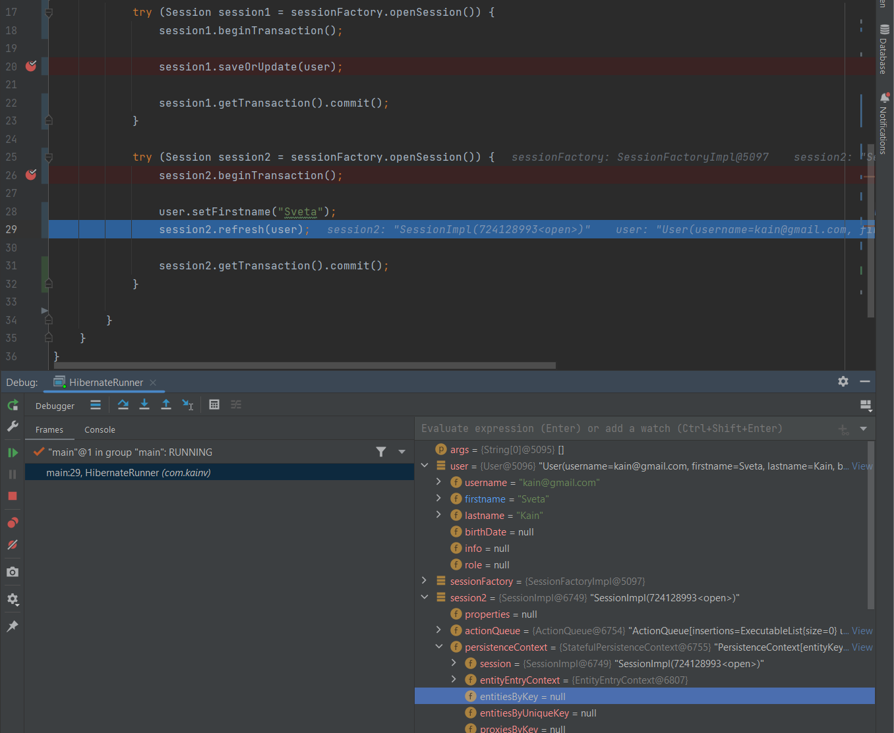

Видим, что firstname для пользователя изменился, но т.к. сущность не проассоциирована с sessiob2, то мы его не видим в кэше. Мы не сделали session2 "dirty". Но как только делаем метод - происходит запрос в базу данных и мы все изменения с базы данных накладываем на нашего user потому что в БД если зайдём, то пользователь Vadim имеет firstname как Vadim, а не Sveta. Поэтому выполняем `session2.refresh(user)`:

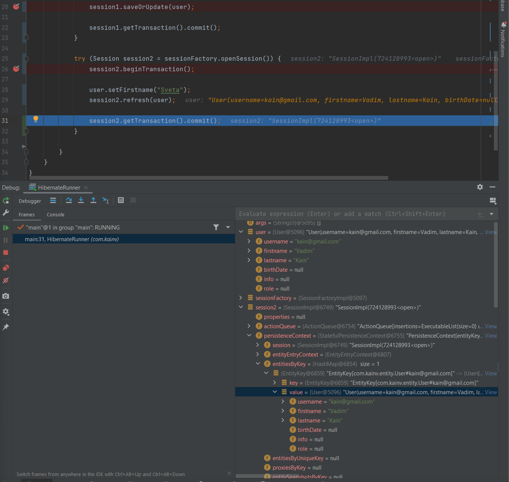

В кэше появился пользователь Vadim, а в нашей сущности user опять Vadim, а не Sveta. Другими словами говоря, под капотом произошло следующее:

    //                У session2 вызываем метод get и получаем свежего пользователя
                    User freshUser = session2.get(User.class, user.getUsername());
    //                Берём этого пользователя и устанавливаем туда все наши поля
                    user.setLastname(freshUser.getLastname());
                    user.setFirstname(freshUser.getFirstname());
    //                И так далее

Т.е. так работает refresh(). Сначала отправляет запрос в БД, получает оттуда свежие данные и синхронизирует эти данные с нашим пользователем устанавливая из базы данных.

### Session.merge()

В свою очередь, merge очень похож на refresh, но за одним исключением: он делает наоборот. Т.е. наши поля в user'е главнее чем те что в БД. Поэтому он точно так же идёт в БД, создаёт сущность на основании этих данных и устанавливает в этого нового юзера данные из старого который передали в метод merge. Поэтому этот метод возвращает объект новый, который получили из БД и на который мы наложили соответствующие изменения. Т.е. в данном случае будет:

    //                У session2 вызываем метод get и получаем свежего пользователя
                    User freshUser = session2.get(User.class, user.getUsername());
    //                Берём этого пользователя и устанавливаем туда все наши поля
                    freshUser.setLastname(user.getLastname());
                    freshUser.setFirstname(user.getFirstname());
    //                И так далее

Посмотрим как отработает merge:

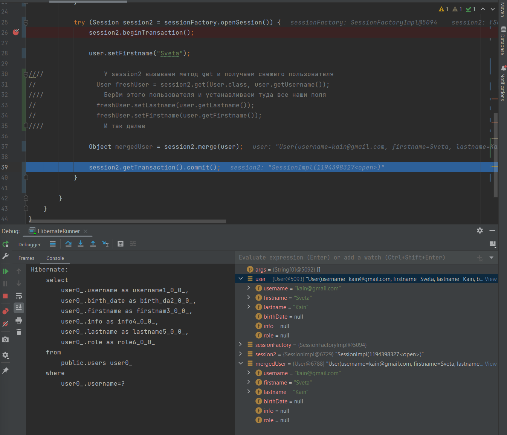

Видим, что произошел select. В дебаге видим нового пользователя, id'шники объектов отличаются (5093 и 6788) т.е. совершенно разные объекты в памяти и в `mergedUser` видим Sveta. Хотя в БД видим, что имя Vadim. Это связано с тем, что psql по умолчанию имеет уровень изолированности READ\_COMMITED. Поэтому мы не увидим изменений из нашего кода, пока не сделает commit транзакции. Теперь, как только заккомимтим транзакцию т.к. сессия теперь "dirty" где есть изменения в наших сущностях, которые не синхронизированы с базами данных. Поэтому в консоли видим запрос update:

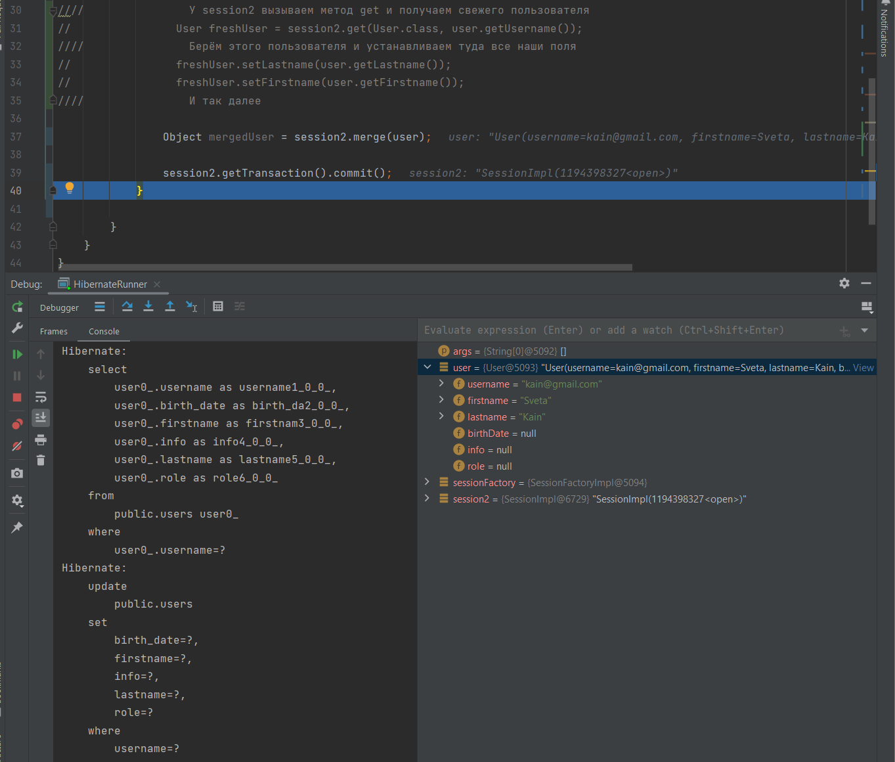

Теперь, если зайдём в БД, то увидим нашего пользователя с обновленными данными:

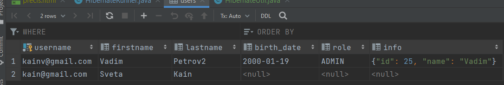

Теперь знаем, что всё крутится вокруг `PersistenceContext` который в свою очередь является кэшем первого уровня и если хотим работать с сущностями в рамках нашей сессии, то обязаны синхронизировать её тем или иным способом с базой данных и положить в ассоциативный массив где ключом является id сущности, а значением сама сущность. На основании этого всего строятся четыре состояния объекта.