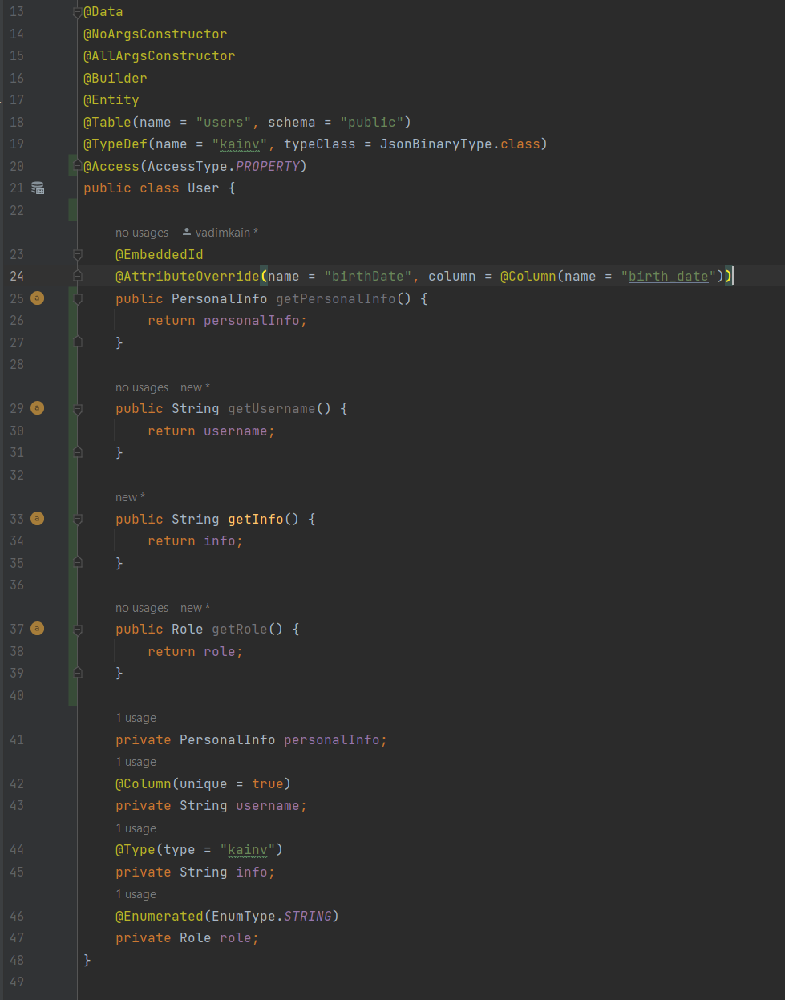
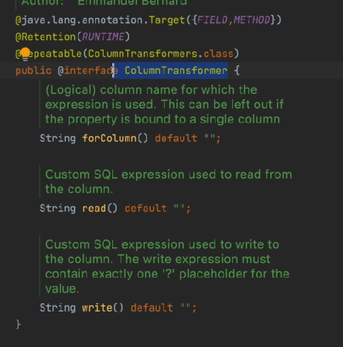

03 - 004 Other basic annotations
================================

Мы почти подошли вплотную к пониманию маппинга ассоциаций. Все что осталось сделать - быстро посмотреть те hibernate аннотации которые в реальных приложениях используются довольно редко, но все таки можем их встретить. На этом тема по базовым маппингам закончится.

@Access(AccessType)
-------------------

Для начала, есть такая аннотация как `@Access(value)`. Суть в том, что мы можем задавать два свойства:

*   `AccessType.FIELD` (по умолчанию) - т.е. то, что у нас есть и без этой аннотации. Она говорит о том, что hibernate будет использовать reflection API для получения доступа к нашим полям сущностей. Это более правильно и предпочтительнее. Но до того как это стало модно использовали именно геттеры и все аннотации которые сейчас есть над нашими полями ставили над соответствующими геттерами.

*   `AccessType.PROPERTY` - т.е. пишем аннотации не над полями, а над соответствующим геттерами:

    

    Устанавливаем, чтобы hibernate понимал что нужно использовать геттеры. Теперь все аннотации над нашими полями будут игнорироваться. Будут отслеживаться аннотации только над соответствующими геттерами к этим полям, а так же именно hibernate через reflection api будет использовать гет методы и соответствующие сет методы вместо того чтобы напрямую устанавливать значения и получать их из полей. Но так лучше не делать.

@Transient
----------

Следующая аннотация `@Transient`. Ее суть та же, что и ключовое слово `transient` в java. Т.е. если есть какое-то поле которое не хотим сохранять в базу данных и извлекать его оттуда - мы должны пометить это поле аннотацией `@Transient`.

**User.java**

    @Transient
    @Enumerated(EnumType.STRING)
    private Role role;

На практике лучше не использовать.

@Temporal(TemporalType)
-----------------------

До того как был введен в Java 8 библиотека DateTime API мы использовали специальный класс который назывался `java.util.Date`. Но суть в том, что в базе данных есть три разных типа данных (Time, TimeStamp, Date), а в java был всего один тип данных - Date. Нам необходимо было указывать какой тип данных в базе данных маппиться на соответствующий тип данных в java и наоборот: как Date преобразовать в TimeStamp, Time или Date. Следовательно, для этого использовалась аннотация над полем `@Temporal(value)`

    @Temporal(TemporalType.TIMESTAMP)
    private Date date;

По умолчанию стоит TIMESTAMP. Это аналог LocalDateTime в java.

@ColumnTransformer
------------------

Мы можем дополнительно указывать в виде обычных SQL вставок read() и write(). Т.е. как считываем и записываем данные в таблицу. Как пример: у нас есть колонка credit\_card\_num и мы хотим во время считывания (read) вызывать встроенную функцию decrypt в базе данных для того чтобы в сущности видели зашифрованное значение credit\_card\_num и наоборот - когда сохраняем в базу данных credit\_card\_num мы хотим вызывать encrypt.

@Formula
--------

Аналогия @ColumnTransformer, но в value() можем указать только тот SQL, который используется во время чтения, но не можем на запись.