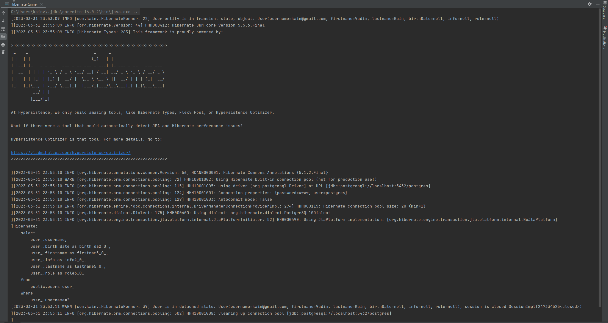

02 - 002 Logging. Файл log4j.xml
================================

В коде у нас всегда будет slf4j, его классы и аннотации которые позволяют изменять логгер на ходу без изменения в коде. Каждый из логеров конфигурируется соответствующим текстовым файлом (properties или xml), но в нашем случае будем использовать xml формат. Он должен лежать в каталоге resources и иметь название **log4j.xml**. Структура выглядит следующим образом:

    <?xml version="1.0" encoding="UTF-8" ?>
            <!DOCTYPE log4j:configuration SYSTEM "log4j.dtd">
    
    <log4j:configuration>
    
        <appender name="console" class="org.apache.log4j.ConsoleAppender">
            <param name="target" value="System.out"/>
    
            <layout class="org.apache.log4j.PatternLayout">
                <param name="ConversionPattern"
                       value="\[%d{yyyy-MM-dd HH:mm:ss} %p \[%c: %L\] %m%n\]"/>
            </layout>
        </appender>
    
        <root>
            <level value="INFO"/>
            <appender-ref ref="console"/>
        </root>
    
    </log4j:configuration>

Здесь есть всего два основных момента: это `<appender>` и логгер (`<root>`). Appender занимается тем, что берёт лог сообщения и отправляет туда, куда укажем, в данном случае `class="org.apache.log4j.ConsoleAppender"` отправляет его на `name="console"` и мы будем его видеть в `value="System.out"`. Т.е. как будто написали `System.out.println()`, а формат этого сообщения задаём с помощью `<layout>`, а именно в нашем случае это `class="org.apache.log4j.PatternLayout"`. Этот паттерн имеет множество специальных символов, которые зарезервированы ( `<param name="ConversionPattern" value="[%d{yyyy-MM-dd HH:mm:ss} %p [%c: %L] %m%n]"`). Нетрудно предположить, что _%d{yyyy-MM-dd HH:mm:ss}_ - время, _%p_ - приоритет (ERROR, FATAL, и т.д.), _\[%c: %L\]_ - класс в котором произошло сообщение и строка кода, _%m%n_ само сообщение. Более подробно можно почитать в документации. Это что-то вроде регулярных выражений.

`<root>` это сам логгер, он единственный логер, но их может быть несколько как и appender'ов. Но суть этого логгера в том, что указываем log-level в `<level value=""/>` с которого начинаем логировать сообщение. Можно указать ALL, тогда будут отображены все сообщения. Второе главное поле это `<appender-ref ref="console"/>` где указываем названием нашего аппендера. В нашем случае, это console. Если таких аппендеров несколько, то можем указать несколько. Все зависит от того, куда и как хотим отправлять наши сообщения. Это своего рода фасад, который решает уже куда отправлять сообщения.

Перейдём в HibernateRunner.java и добавим этот логгер
-----------------------------------------------------

Обычно создаётся один логгер из библиотеки _org.slf4j_ чтобы потом можно было динамически добавить любой из логгеров:

    import org.slf4j.LoggerFactory;
    import org.slf4j.Logger;

    public class HibernateRunner {
        public static final Logger logger = LoggerFactory.getLogger(HibernateRunner.class);

В таком случае, в сообщении мы будем видеть в каком классе произошёл message. Следовательно, логгер как раз таки и хранит этот класс HibernateRunner. Далее, мы хотим написать какое-то сообщение:

**HibernateRunner.java**

    package com.kainv;

    import com.kainv.entity.User;
    import com.kainv.util.HibernateUtil;
    import org.hibernate.Session;
    import org.hibernate.SessionFactory;
    import org.hibernate.Transaction;
    import org.slf4j.LoggerFactory;
    import org.slf4j.Logger;

    public class HibernateRunner {
        public static final Logger logger = LoggerFactory.getLogger(HibernateRunner.class);

        public static void main(String\[\] args) {
            User user = User.builder()
                    .username("kain@gmail.com")
                    .lastname("Kain")
                    .firstname("Vadim")
                    .build();

    //        Пишем лог уровня INFO
            logger.info("User entity is in transient state, object: {}", user);

            try (SessionFactory sessionFactory = HibernateUtil.buildSessionFactory()) {
                Session session1 = sessionFactory.openSession();
                try (session1) {
                    Transaction transaction = session1.beginTransaction();

    //                Создаём лог уровня TRACE
                    logger.trace("Transaction is created, {}", transaction);

                    session1.saveOrUpdate(user);
                    logger.trace("User is in persistent state: {} session {}", user, session1);

                    session1.getTransaction().commit();
                }

    //            Создаём лог уровня WARN. Это не ошибка, но стоит обратить внимание программисту
                logger.warn("User is in detached state: {}, session is closed {}", user, session1);
            } catch (Exception exception) {
    //            Создаём лог уровня ERROR и отображаем весь stacktrace
                logger.error("Exception occurred", exception);
                throw exception;
            }
        }
    }

Вызовем класс `HibernateRunner` и посмотрим, что у нас отобразится:

Видим, что все красиво отображается без красных сообщений. Видим, что информация нам выводится в том виде, в котором её прописали в log4j.xml.