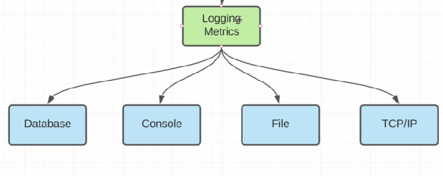
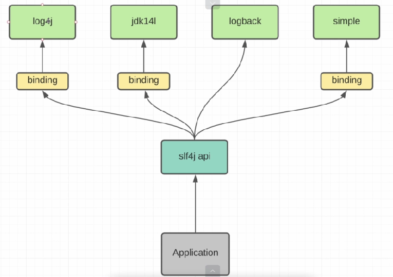
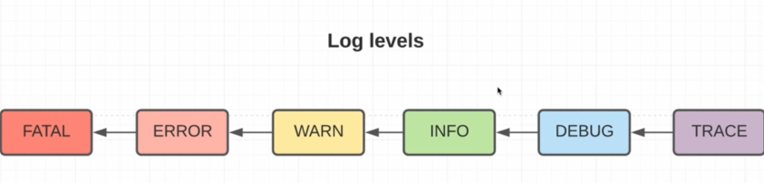

02 - 001 Logging. Теория
========================

Когда выполняем наш код, то у нас довольно много различных сообщений от Hibernate, но явно таких сообщений не делали. Это встроенная система логирования в хайбернете. Система логирования гораздо сложнее чем `System.out.println()`. Разберёмся более подробно в них.

Для начала представим наше обычное приложение, которое написали, развернули на удаленном сервере и им пользуются наши пользователи. Но к сожалению, если не будем подключать никакие системы логирования либо метрик, то наше приложение будет черным ящиком (black box) и если что-то пойдёт не так, то мы даже не узнаем об этом, а если нужно будет еще и решить эту проблему, то тем более. Наша задача: из black box сделать white box. Для этого у нас есть система логирования и метрик. При чем они бывают довольно разными.

В случае логирования здесь все довольно понятно. Это просто сообщения об какой-то информации, возможно ошибке, возможно просто уведомление либо warning. Суть в том, что это простое сообщение которое может анализировать программист. В случае же метрик это какая-то статистика о приложении. Например, как часто обращается код в БД или какая чаще нагрузка на приложение (т.е. **RPS** - Request Per Second) либо то, как долго ждёт пользователь своего ответа от приложения как только он отправил какой-то запрос. Таких статистик можно делать очень много в зависимости от логики приложения и нужд.

Возвращаясь к логированию, мы чаще всего прибегали к `System.out.println()`. Но это работает только пока разрабатываем приложение потому что наша консоль есть в среде разработки. Но если развернем приложение на удаленном сервере, то там у нас не будет никакой консоли потому что нет среды разработки. Следственно мы можем использовать **File**. Т.е. все сообщения помещать в файл, это неудобно поскольку в реальных приложениях эти файлы невероятно больших размеров. Гораздо удобнее это складывать в базу данных ( **Database**) и тогда обычным SQL запросом можно доставать к примеру Error'ы либо Stacktrace по этим error'ам, либо warn, что гораздо удобнее уже для программистов. Но в реальных приложениях отправляет эти сообщения какому-то удаленному серверу, который занимается логированием через **TCP/IP** соединение. Уже это приложение знает как анализировать логи либо метрики.

Уже есть множество готовых фреймворков для логов и метрик. Для логов это например **ELK - Elasticksearch, Logstash, Kibana** который вмещает в себе три инструмента (и как хранилище, и как парсер логов, и как view для отображения сообщений). В случае метрик - это самый известный **Prometheus** (анализирует пользовательские метрики, более того можно прикручивать различные системы alert'инга для того чтобы в случае реальных систем отправить сообщение на телефон или канал если срочно надо отреагировать на ошибку), **Grafana**.

Пока наша задача - подключить и использовать систему логирования в Hibernate. Есть многоразличных логов.

Систем логирования довольно много и мы можем захотеть изменить систему логирования в нашем приложении. Если приводить аналог, то это что-то вроде Hibernate - т.е. реализация JPA, а сама JPA (т.е. набор интерфейсов которые можем использовать) это **slf4j api**. Т.е. используем API **slf4j**, а он уже использует тот логер который ему подставляем (log4j, logback и т.д.). Для некоторых логгеров нужен своего рода **binding**, т.е. адаптера как обращаться к нему. Наша задача в нашем приложении - просто использовать готовый API **slf4j**, а в линковщике подключить необходимую зависимость (логинг).

Для простоты и удобства поиска придумали так называемые **Log levels**:

Т.е. когда мы генерируем какую-ту ошибку или просто сообщение в консоль/файл (неважно) - мы присваиваем этому сообщению соответсвующий уровень. Их шесть штук. Они не зря называются уровнями потому что чем выше уровень (начиная от TRACE заканчивая FATAL) тем ошибка жёще. Более того, когда будем подключать систему логирования - мы должны будем выставить соответствующий уровень, который хотим отображать программисту. Например, если укажем INFO, то будем видеть только ошибки INFO и выше.

Подключим slf4j в приложение
----------------------------

Идём в линковщик и видим, что уже подключили slf4j api:

        <dependency>
            <groupId>org.slf4j</groupId>
            <artifactId>slf4j-nop</artifactId>
            <version>1.7.30</version>
        </dependency>

Мы его подключили потому что наш `<artifactId>hibernate-types-52</artifactId>` требовал его. Но если хотим использовать log4j, то нам нужно использовать **binding** чтобы slf4j знала как работать с log4j. Для этого нам нужно подключить дополнительную зависимость:

**pom.xml**

        <dependency>
            <groupId>org.slf4j</groupId>
            <artifactId>slf4j-log4j12</artifactId>
            <version>1.7.32</version>
        </dependency>

Более того, эта зависимость имеет транзитивную зависимость на slf4j следственно мы можем убрать зависимость `<artifactId>slf4j-nop</artifactId>` в pom.xml

**pom.xml**

        <!-- https://mvnrepository.com/artifact/com.vladmihalcea/hibernate-types-52 -->
        <dependency>
            <groupId>com.vladmihalcea</groupId>
            <artifactId>hibernate-types-52</artifactId>
            <version>2.12.1</version>
        </dependency>

        <!--        <dependency>-->
        <!--            <groupId>org.slf4j</groupId>-->
        <!--            <artifactId>slf4j-nop</artifactId>-->
        <!--            <version>1.7.30</version>-->
        <!--        </dependency>-->

        <!-- https://mvnrepository.com/artifact/org.slf4j/slf4j-log4j12 -->
        <dependency>
            <groupId>org.slf4j</groupId>
            <artifactId>slf4j-log4j12</artifactId>
            <version>1.7.32</version>
        </dependency>