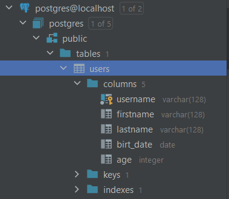
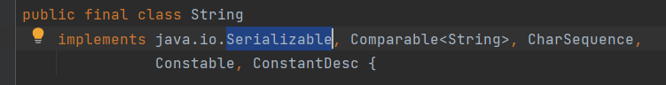
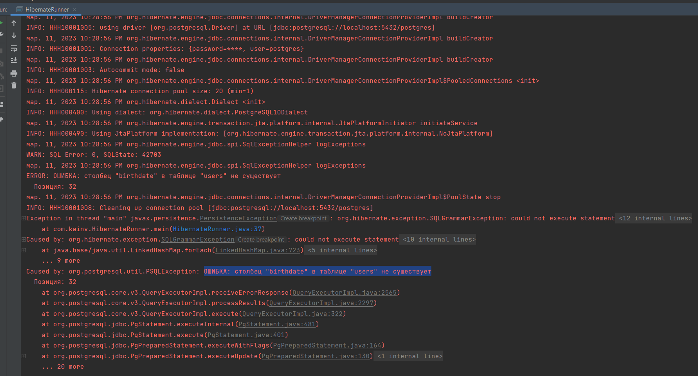
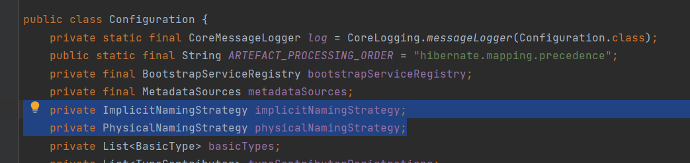
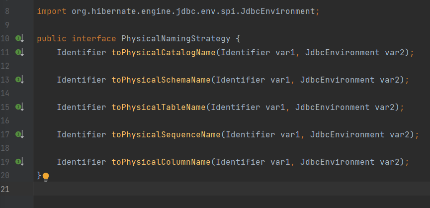
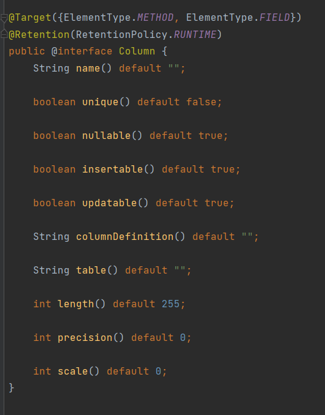
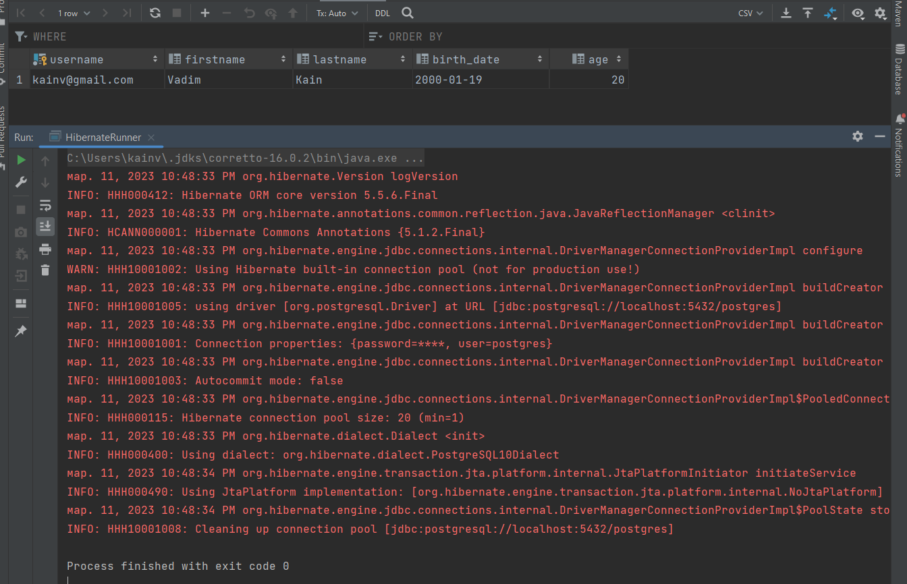

005 Entity
==========

Для ORM нам нужны сущности. Т.е. то, что будем проецировать на таблицу в базе данных. Т.е. мы должны создать сущность User, у которой будут соответствующие поля и для этого мы должны просто смаппить эти колонки в таблице users на поля в нашем классе `User`.

Начнём. Для этого создадим класс в пакете entity с названием User:

    package com.kainv.entity;

    import java.time.LocalDate;

    public class User {
        private String username;
        private String firstname;
        private String lastname;
        //    Преобразовываем snake case (в sql) в camel case (в java)
        private LocalDate birthDate;
        private Integer age;
    }

По факту, age нам не нужен поскольку есть birthDate, но сделали это для примера. С полями, у которых нет внешних ключей на другие таблицы работать довольно просто. Теперь, для того чтобы этот класс стал сущностью hibernate - **необходимо несколько правил**:

1.  Сущность должна быть **POJO (Plain Old Java Object)**. Следовательно, у него должны быть все поля private и соответствующие get'теры и set'теры к ним. Поэтому генерируем их ко всем полям.

2.  Сущность должна быть **не immutable** поэтому у него есть соответствующие сеттеры, следственно мы не можем давать final модификатор ко всем полям. Hibernate всегда изменяет в свой жизненном цикле. Соответственно, сам класс не может быть final потому что Hibernate работает очень часто с proxy и этот proxy работает по принципу CGLIB, т.е. создаёт наследника от нашего класса поэтому и не нужно использовать final определение класса.

3.  У сущности **должен быть** конструктор **без** параметров. Это обязательно потому что Hibernate использует Reflection API для создания наших сущностей и последующей инициализации через сеттеры или напрямую через Reflection API устанавливать свойства для наших полей.

Добавим так же конструктор со своими параметрами, который так же будем использовать для инициализации сущности и конечно же toString, equals & hashCode. Т.е. получается обычный POJO поскольку часто используем сущности в коллекциях. Есть так же маленькие нюансы: что использовать в качестве equals & hashCode - какие поля, все или только идентификаторы потому что в БД первыичный ключ является уникальным идентификатором наших строк. И, следовательно, в сущностях скорее всего так же захотим такой вариант использовать, но это рассмотрим позже.

    package com.kainv.entity;

    import java.time.LocalDate;
    import java.util.Objects;

    public class User {
        private String username;
        private String firstname;
        private String lastname;
        //    Преобразовываем snake case (в sql) в camel case (в java)
        private LocalDate birthDate;
        private Integer age;

        public User() {
        }

        public User(String username, String firstname, String lastname, LocalDate birthDate, Integer age) {
            this.username = username;
            this.firstname = firstname;
            this.lastname = lastname;
            this.birthDate = birthDate;
            this.age = age;
        }

        public String getUsername() {
            return username;
        }

        public void setUsername(String username) {
            this.username = username;
        }

        public String getFirstname() {
            return firstname;
        }

        public void setFirstname(String firstname) {
            this.firstname = firstname;
        }

        public String getLastname() {
            return lastname;
        }

        public void setLastname(String lastname) {
            this.lastname = lastname;
        }

        public LocalDate getBirthDate() {
            return birthDate;
        }

        public void setBirthDate(LocalDate birthDate) {
            this.birthDate = birthDate;
        }

        public Integer getAge() {
            return age;
        }

        public void setAge(Integer age) {
            this.age = age;
        }

        @Override
        public String toString() {
            return "User{" +
                   "username='" + username + '\\'' +
                   ", firstname='" + firstname + '\\'' +
                   ", lastname='" + lastname + '\\'' +
                   ", birthDate=" + birthDate +
                   ", age=" + age +
                   '}';
        }

        @Override
        public boolean equals(Object o) {
            if (this == o) return true;
            if (o == null || getClass() != o.getClass()) return false;
            User user = (User) o;
            return Objects.equals(username, user.username) && Objects.equals(firstname, user.firstname) && Objects.equals(lastname, user.lastname) && Objects.equals(birthDate, user.birthDate) && Objects.equals(age, user.age);
        }

        @Override
        public int hashCode() {
            return Objects.hash(username, firstname, lastname, birthDate, age);
        }
    }

В итоге, у нас появляется много бойлерплейт кода, который не нужен вовсе. Что нам нужно сделать - это определить поля в наших сущностях. Для этого как раз таки подключили ломбок. Ставим аннотацию `@Data` которая сгенерирует equals, hashCode, get'теры, set'теры, toString и т.д.. Далее нам нужен конструктор с и без параметров, для этого есть аннотации `@NoArgsConstructor` и `@AllArgsConstructor`. Так же сгенерируем `@Builder` чтобы красиво создавать и инициализировать сущности.

    @Data
    @NoArgsConstructor
    @AllArgsConstructor
    @Builder
    public class User {
        private String username;
        private String firstname;
        private String lastname;
        //    Преобразовываем snake case (в sql) в camel case (в java)
        private LocalDate birthDate;
        private Integer age;
    }

Мы создали наш POJO. Теперь, следующий этап, это сказать, что POJO - сущность hibernate. И для этого нужно использовать соответствующую аннотацию `@Entity` из пакета javax.persistence. Это уже не hibernate зависимость, а JPA.

Теперь у нас проблема в том, что каждая сущность в Hibernate должна иметь первичный ключ. Для этого есть вторая аннотация обязательная - это `@Id` из пакета JPA.

    @Data
    @NoArgsConstructor
    @AllArgsConstructor
    @Builder
    @Entity
    public class User {
        @Id
        private String username;
        private String firstname;
        private String lastname;
        //    Преобразовываем snake case (в sql) в camel case (в java)
        private LocalDate birthDate;
        private Integer age;
    }

Теперь мы сделали минимальные требования для того чтобы этот класс User был hibernate сущностью. Он POJO и содержит две главные аннотации: `@Entity` и `@Id`. **Внимание:** @Id должен быть serializable. Т.е. тип идентификатора должен реализовывать интерфейс Serializable:

Это нужно для своих внутренних механизмов связанных с кэшированием. Теперь попробуем создать эту сущность и сохранить в базу данных. Идем в HibernateRunner в блоке try. Для сохранения сущности в БД используем объект `Session`. В Session есть специальный метод `save()`, в которую просто передаём сущность.

    public class HibernateRunner {
        public static void main(String\[\] args) throws SQLException {
    //        BlockingQueue<Connection> pool = null;
    //        Connection connection = pool.take();
    //        SessionFactory
    
    //        Connection connection = DriverManager
    //                .getConnection("db.url", "db.username", "db.password");
    //        Session
    
            Configuration configuration = new Configuration();
            configuration.configure();
    
            try (
                    SessionFactory sessionFactory = configuration.buildSessionFactory();
                    Session session = sessionFactory.openSession()
            ) {
                User user = User.builder()
                        .username("kainv@gmail.com")
                        .firstname("Vadim")
                        .lastname("Kain")
                        .birthDate(LocalDate.of(2000, 1, 19))
                        .age(20)
                        .build();
    
                session.save(user);
            }
        }
    }

Для того чтобы отправлять запросы в БД - мы должны работать с транзакциями. В случае hibernate мы должны делать это вручную. Т.е. тут не auto-commit mode. Следственно, мы должны в `session` вызывать `beginTransaction()` и закрывать транзакцию:

    public class HibernateRunner {
        public static void main(String\[\] args) throws SQLException {
    //        BlockingQueue<Connection> pool = null;
    //        Connection connection = pool.take();
    //        SessionFactory
    
    //        Connection connection = DriverManager
    //                .getConnection("db.url", "db.username", "db.password");
    //        Session
    
            Configuration configuration = new Configuration();
            configuration.configure();
    
            try (
                    SessionFactory sessionFactory = configuration.buildSessionFactory();
                    Session session = sessionFactory.openSession()
            ) {
                session.beginTransaction();
                
                User user = User.builder()
                        .username("kainv@gmail.com")
                        .firstname("Vadim")
                        .lastname("Kain")
                        .birthDate(LocalDate.of(2000, 1, 19))
                        .age(20)
                        .build();
    
                session.save(user);
                
                session.getTransaction().commit();
            }
        }
    }

Теперь попробуем сохранить сущность запустив программу. Но сначала нам нужно добавить єту сущность в нашу сессию. Для этого есть два варианта:

1.  **Специальный конфиг xml** - т.е. в настройках конфигурации указать: `configuration.addClass(Class class)`

2.  Указать `configuration.addAnotatedClass(Class class)`

С помощью xml уже давно никто не маппит классы следственно все используют аннотации. Поэтому воспользуемся вторым вариантом чтобы hibernate отслеживал сущность:

    public class HibernateRunner {
        public static void main(String\[\] args) throws SQLException {
            Configuration configuration = new Configuration();
            configuration.addAnnotatedClass(User.class);
            configuration.configure();

            try (
                    SessionFactory sessionFactory = configuration.buildSessionFactory();
                    Session session = sessionFactory.openSession()
            ) {
                session.beginTransaction();

                User user = User.builder()
                        .username("kainv@gmail.com")
                        .firstname("Vadim")
                        .lastname("Kain")
                        .birthDate(LocalDate.of(2000, 1, 19))
                        .age(20)
                        .build();
    
                session.save(user);

                session.getTransaction().commit();
            }
        }
    }

Либо второй вариант, который в нашем случае возможно будет более предпочтительный - это в нашем hibernate.cfg.xml добавить маппинг:

**hibernate.cfg.xml**

    <?xml version='1.0' encoding='utf-8'?>
            <!DOCTYPE hibernate-configuration PUBLIC
            "-//Hibernate/Hibernate Configuration DTD//EN"
            "http://www.hibernate.org/dtd/hibernate-configuration-3.0.dtd">
    <hibernate-configuration>
        <session-factory>
            <property name="connection.url">jdbc:postgresql://localhost:5432/postgres</property>
            <property name="connection.username">postgres</property>
            <property name="connection.password">postgres</property>
            <property name="connection.driver\_class">org.postgresql.Driver</property>
            <!--        Указываем диалект -->
            <property name="hibernate.dialect">org.hibernate.dialect.PostgreSQL10Dialect</property>
    
            <mapping class="com.kainv.entity.User" />
            <!-- DB schema will be updated if needed -->
            <!-- <property name="hibernate.hbm2ddl.auto">update</property> -->
        </session-factory>
    </hibernate-configuration>

В случае xml мы сразу же добавляем эти маппинги. Это может быть не очень удобно потому что динамически позволяет добавлять нам эти сущности и искать их в соответствующих пакетах именно методы. Т.е. `configuration.addAnnotatedClass(User.class);`, что и использует спринг в своем функционале.

Подключим ещё пару пропертисов, который очень помогут. Это show\_sql - чтобы видели какой sql формирует нам hibernate и format\_sql, чтобы он ещё и форматировал красиво.

    <?xml version='1.0' encoding='utf-8'?>
            <!DOCTYPE hibernate-configuration PUBLIC
            "-//Hibernate/Hibernate Configuration DTD//EN"
            "http://www.hibernate.org/dtd/hibernate-configuration-3.0.dtd">
    <hibernate-configuration>
        <session-factory>
            <property name="connection.url">jdbc:postgresql://localhost:5432/postgres</property>
            <property name="connection.username">postgres</property>
            <property name="connection.password">postgres</property>
            <property name="connection.driver\_class">org.postgresql.Driver</property>
            <!--        Указываем диалект -->
            <property name="hibernate.dialect">org.hibernate.dialect.PostgreSQL10Dialect</property>
    
            <property name="show\_sql"/>
            <property name="format\_sql"/>
    
            <mapping class="com.kainv.entity.User"/>
            <!-- DB schema will be updated if needed -->
            <!-- <property name="hibernate.hbm2ddl.auto">update</property> -->
        </session-factory>
    </hibernate-configuration>

Прежде чем запустить нам ещё потребуется указать конкретное название таблицы в БД через аннотацию над сущностью. Это связано с тем, что по умолчанию Hibernate берет название класса/полей в качестве названия таблицы/колонок в базе данных (SQL не чувствителен к регистру). Для этого используем аннотацию `@Table`. Эта аннотация является runtime и в ней можем указать название таблицы, каталог, схему и т.д. (смотреть документацию). Поэтому, укажем название таблицы и схему:

    @Data
    @NoArgsConstructor
    @AllArgsConstructor
    @Builder
    @Entity
    @Table(name = "users", schema = "public")
    public class User {
        @Id
        private String username;
        private String firstname;
        private String lastname;
        //    Преобразовываем snake case (в sql) в camel case (в java)
        private LocalDate birthDate;
        private Integer age;
    }

Теперь, если запустим, то увидим следующую ошибку:

Дело в том, что в БД поле birth\_date указано через snake case, а в классе User - через camel case. В нашем случае мы хотим чтобы camel case в java формировался в snake case в SQL. Для этого нам нужно использовать другую настройку NamingStrategy из Configuration, а именно PhysicalNamingStrategy. Этот интерфейс необходим для формирования названия таблиц, схем, колонок в БД на основании названий классов и полей в java.

 

Все это можем переопределить. По умолчанию используется `PhysicalNamingStrategyStandardImlp`, но мы можем использовать `CamelCaseToUnderscoresNamingStrategy`, который как раз таки нам и нужен. Следовательно, в `configuration` устанавливает `setPhysicalNamingStrategy(new CamelCaseToUnderscoresNamingStrategy())`.

Либо, второй вариант, мы можем в нашем классе Users использовать другую аннотацию по типу @Table, только она называется `@Column`, тоже из JPA:

    @Data
    @NoArgsConstructor
    @AllArgsConstructor
    @Builder
    @Entity
    @Table(name = "users", schema = "public")
    public class User {
        @Id
        private String username;
        private String firstname;
        private String lastname;
        @Column(name = "birth\_date")
        private LocalDate birthDate;
        private Integer age;
    }

Это runtime аннотация, которую можно ставить над полем и над методом. Здесь можно указать много мета-информации про наши колонки:

Т.е. то, что можно вставлять, что нет. Размер колонки (как будто varchar(128)), название, nullable, точность и т.д.. Hibernate поддерживает автосоздание DDL на основании всех этих мета-информаций.

Теперь запустим HibernateRunner и увидим, что данные добавились в базу:

