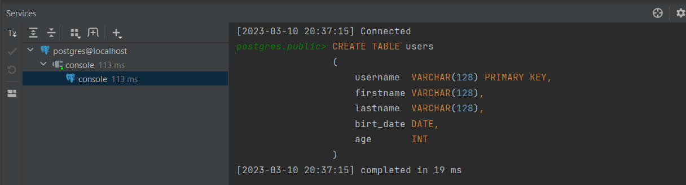

003 Настройка проекта
---------------------

Настраиваем pom.xml. Устанавливаем hibernate, драйвер postgresql, project lombok. Указываем, что будем работать с java 16. Подключаемся к БД из IDE

    <?xml version="1.0" encoding="UTF-8"?>
            <project xmlns="http://maven.apache.org/POM/4.0.0"
                     xmlns:xsi="http://www.w3.org/2001/XMLSchema-instance"
                     xsi:schemaLocation="http://maven.apache.org/POM/4.0.0 http://maven.apache.org/xsd/maven-4.0.0.xsd">
        <modelVersion>4.0.0</modelVersion>
    
        <groupId>com.kainv</groupId>
        <artifactId>Hibernate</artifactId>
        <version>1.0-SNAPSHOT</version>
    
        <properties>
            <maven.compiler.source>16</maven.compiler.source>
            <maven.compiler.target>16</maven.compiler.target>
            <project.build.sourceEncoding>UTF-8</project.build.sourceEncoding>
        </properties>
    
        <dependencies>
            <dependency>
                <groupId>org.junit.jupiter</groupId>
                <artifactId>junit-jupiter-api</artifactId>
                <version>5.7.2</version>
                <scope>test</scope>
            </dependency>
    
            <!-- https://mvnrepository.com/artifact/org.hibernate/hibernate-core -->
            <dependency>
                <groupId>org.hibernate</groupId>
                <artifactId>hibernate-core</artifactId>
                <version>5.5.6.Final</version>
            </dependency>
    
            <!-- https://mvnrepository.com/artifact/org.postgresql/postgresql -->
            <dependency>
                <groupId>org.postgresql</groupId>
                <artifactId>postgresql</artifactId>
                <version>42.2.27</version>
                <scope>runtime</scope>
            </dependency>
    
            <dependency>
                <groupId>org.projectlombok</groupId>
                <artifactId>lombok</artifactId>
                <version>1.18.20</version>
                <scope>provided</scope>
            </dependency>
    
        </dependencies>
    
        <build>
            <plugins>
                <plugin>
                    <groupId>org.apache.maven.plugins</groupId>
                    <artifactId>maven-compiler-plugin</artifactId>
                    <version>3.8.1</version>
                </plugin>
    
                <plugin>
                    <groupId>org.apache.maven.plugins</groupId>
                    <artifactId>maven-surefire-plugin</artifactId>
                    <version>2.22.2</version>
                </plugin>
            </plugins>
        </build>
    </project>

После присоединения к БД создадим тестовую таблицу:

    CREATE TABLE users
    (
        username  VARCHAR(128) PRIMARY KEY,
        firstname VARCHAR(128),
        lastname  VARCHAR(128),
        birt\_date DATE,
        age       INT
    );

Теперь все настроено.