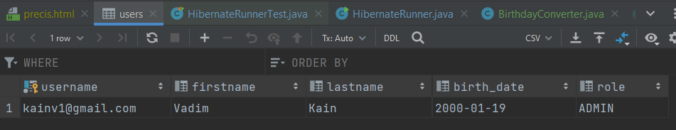
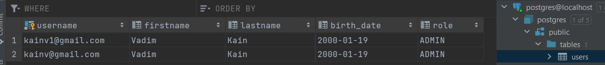

008 Custom attribute converter
==============================

В 007 мы разобрались как hibernate преобразовывает java-типы в sql-типы и наоборот используя реализации интерфейса `Type`. Есть эти реализации практически на любые случаи жизни. Но все таки в каких-то ситуациях хотим написать свой тип. В этом случае нам необходимо будет написать свою реализацию либо второй вариант - это написать свой конвертер. Для этого в Type есть специальный класс: `AttributeConverter<From, To>`. Для того чтобы он у нас срабатывал нужно написать свой конвертер и реализовать один единственный интерфейс.

Попробуем реализовать. Для этого в нашем `User` создадим специальный класс, в entity засунем его. Называться будет `Birthday`. Сделаем его `record` и у него будет одно единственное поле `LocalDate birthDate`. В User удалим поле age, а LocalDate birthDate заменим на `Birthday birthDate`:

    @Data
    @NoArgsConstructor
    @AllArgsConstructor
    @Builder
    @Entity
    @Table(name = "users", schema = "public")
    public class User {
        @Id
        private String username;
        private String firstname;
        private String lastname;
        @Column(name = "birth\_date")
        private Birthday birthDate;
        @Enumerated(EnumType.STRING)
        private Role role;
    }

    

    package com.kainv.entity;
    
    import java.time.LocalDate;
    
    public record Birthday (LocalDate birthDate) {
    }

Создадим метод `getAge()` который будет определять разницу между ДР и текущей датой.

    public record Birthday(LocalDate birthDate) {
        public long getAge() {
            return ChronoUnit.YEARS.between(birthDate, LocalDate.now());
        }
    }

Осталось создать конвертер. Для этого создадим его в директории converter и назовем `BirthdayConverter`, он должен реализовывать один единственный интерфейс `AttributeConverter<From, To>`:

    package com.kainv.converter;
    
    import com.kainv.entity.Birthday;
    
    import javax.persistence.AttributeConverter;
    import java.util.Date;
    
    public class BirthdayConverter implements AttributeConverter<Birthday, Date> {
        @Override
        public Date convertToDatabaseColumn(Birthday birthday) {
            return null;
        }
    
        @Override
        public Birthday convertToEntityAttribute(Date date) {
            return null;
        }
    }

*   `Date convertToDatabaseColumn()` - когда нужно преобразовать java-объект в SQL.
*   `Birthday convertToEntityAttribute()` - когда считываем с SQL и переводим в java-объект.

    package com.kainv.converter;

    import com.kainv.entity.Birthday;

    import javax.persistence.AttributeConverter;
    import java.sql.Date;
    import java.util.Optional;

    public class BirthdayConverter implements AttributeConverter<Birthday, Date> {
    @Override
    public Date convertToDatabaseColumn(Birthday birthday) {
    //        Проверяем, какое значение пришло (null/not null)
    return Optional.ofNullable(birthday)
    //                Извлекаем дату
    .map(Birthday::birthDate)
    //                Преобразовываем из java.sql.Date
    .map(Date::valueOf)
    //                В противном случае возвращаем null
    .orElse(null);
    }

        @Override
        public Birthday convertToEntityAttribute(Date date) {
    //        Проверяем, какое значение пришло (null/not null)
    return Optional.ofNullable(date)
    //                Преобразовываем в LocalDate
    .map(Date::toLocalDate)
    //                И создаём класс Birthday
    .map(Birthday::new)
    //                Иначе возвращаем null, если не пришла date
    .orElse(null);
    }
    }

Теперь идём в нашу сущность `User` и теперь мы должны подсказать hibernate что он должен использовать именно этот конвертер (`BirthdayConverter`) для преобразования в birthDate и наоборот. Для этого есть специальная аннотация `@Convert()`, в котором есть несколько методов, но основной из них это `converter`, где указываем класс конвертера:

    @Data
    @NoArgsConstructor
    @AllArgsConstructor
    @Builder
    @Entity
    @Table(name = "users", schema = "public")
    public class User {
        @Id
        private String username;
        private String firstname;
        private String lastname;
        @Convert(converter = BirthdayConverter.class)
        @Column(name = "birth\_date")
        private Birthday birthDate;
        @Enumerated(EnumType.STRING)
        private Role role;
    }

Теперь Hibernate будет знать как использовать наш AttributeConverterType. Идём в HibernateRunner, поправляем User user:

    public class HibernateRunner {
        public static void main(String\[\] args) {
            Configuration configuration = new Configuration();
    //        configuration.setPhysicalNamingStrategy(new CamelCaseToUnderscoresNamingStrategy());
    //        configuration.addAnnotatedClass(User.class);
            configuration.configure();

    //        Failed to resolve org.junit.platform:junit-platform-launcher:1.7.2

    //        11:33

            try (
                    SessionFactory sessionFactory = configuration.buildSessionFactory();
                    Session session = sessionFactory.openSession()
            ) {
                session.beginTransaction();

                User user = User.builder()
                        .username("kainv1@gmail.com")
                        .firstname("Vadim")
                        .lastname("Kain")
                        .birthDate(new Birthday(LocalDate.of(2000, 1, 19)))
                        .role(Role.ADMIN)
                        .build();

                session.save(user);

                session.getTransaction().commit();
            }
        }
    }

И так же поправим наш тест:

    class HibernateRunnerTest {
        @Test
        void checkReflectionApi() throws SQLException, IllegalAccessException {
            User user = User.builder()
    //                Здесь нам в принципе ничего не надо
                    .build();

Осталось поправить нашу БД:

    CREATE TABLE users
    (
        username  VARCHAR(128) PRIMARY KEY,
        firstname VARCHAR(128),
        lastname  VARCHAR(128),
        birth\_date DATE,
        role      VARCHAR(32)
    );

Запускаем HibernateRunner и проверим наших пользователей в БД:

Можно ещё проще сделать и подсказать хайбернейту, чтобы он автоматически использовал этот конвертер когда видит наш birthDate в любой из наших сущностей чтобы нам не приходилось каждый раз прописывать `@Converter` над соответствующим полем. В таком случае, мы в `Configuration` должны указать этот конвертер при помощи `configuration.addAttributeConverter(new BirthdayConverter(), true);` обязательно ставим true чтобы не приходилось вручную ставить аннотацию `@Convert`. Или вместо true поставить над конвертером аннотацию `@Converter(autoApply = true)`:

    @Converter(autoApply = true)
    public class BirthdayConverter implements AttributeConverter<Birthday, Date> {
    

    public class HibernateRunner {
        public static void main(String\[\] args) {
            Configuration configuration = new Configuration();
    //        configuration.setPhysicalNamingStrategy(new CamelCaseToUnderscoresNamingStrategy());
    //        configuration.addAnnotatedClass(User.class);
            configuration.addAttributeConverter(new BirthdayConverter());
            configuration.configure();

            try (
                    SessionFactory sessionFactory = configuration.buildSessionFactory();
                    Session session = sessionFactory.openSession()
            ) {
                session.beginTransaction();

                User user = User.builder()
                        .username("kainv@gmail.com")
                        .firstname("Vadim")
                        .lastname("Kain")
                        .birthDate(new Birthday(LocalDate.of(2000, 1, 19)))
                        .role(Role.ADMIN)
                        .build();

                session.save(user);

                session.getTransaction().commit();
            }
        }
    }
    

    @Data
    @NoArgsConstructor
    @AllArgsConstructor
    @Builder
    @Entity
    @Table(name = "users", schema = "public")
    public class User {
        @Id
        private String username;
        private String firstname;
        private String lastname;
    //    @Convert(converter = BirthdayConverter.class)
        @Column(name = "birth\_date")
        private Birthday birthDate;
        @Enumerated(EnumType.STRING)
        private Role role;
    }

Вызываем `HibernateRunner` и смотрим результат:

