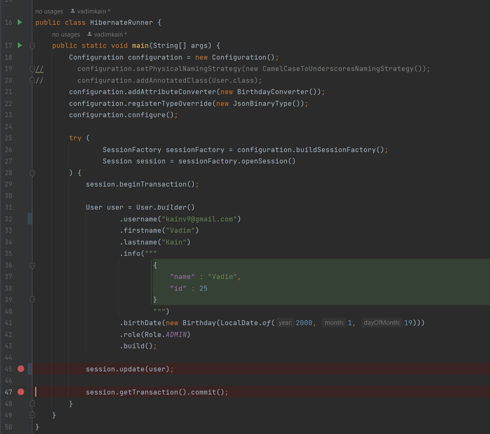
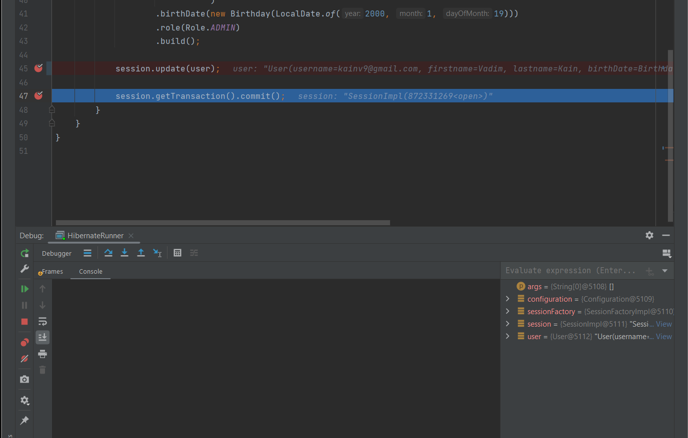
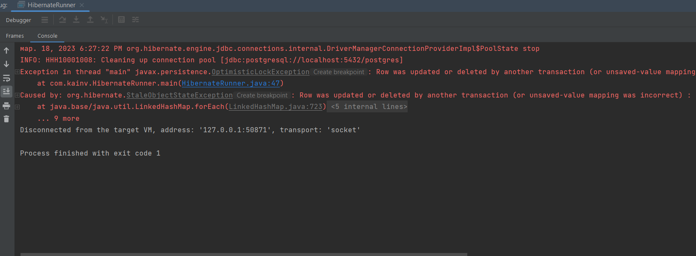
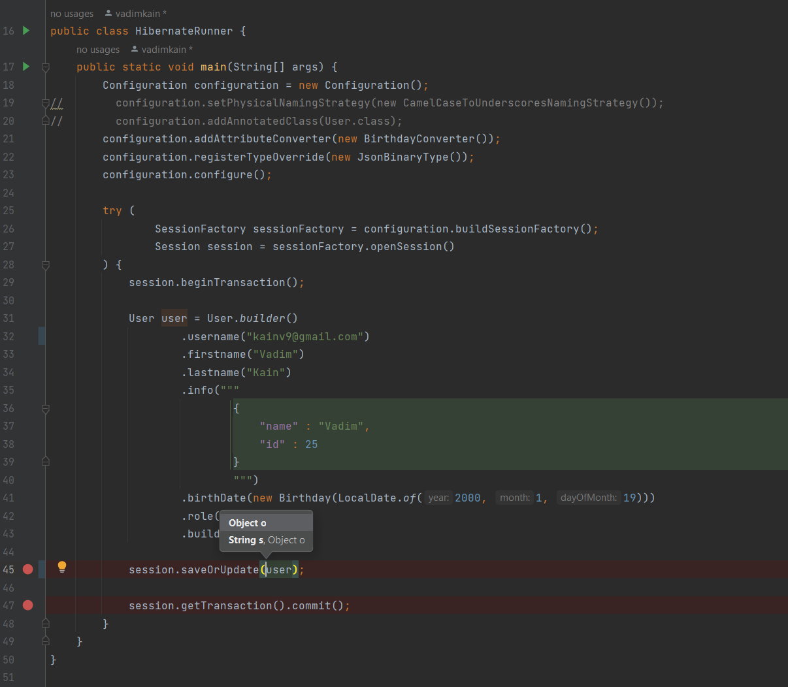
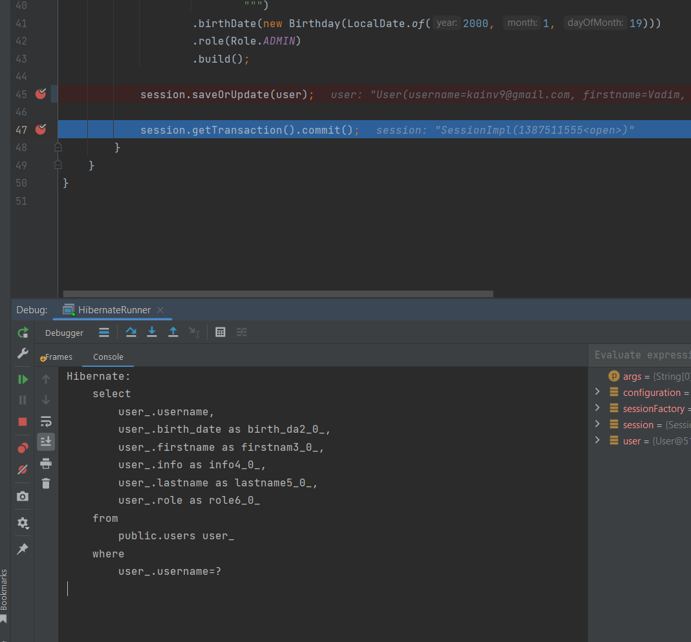
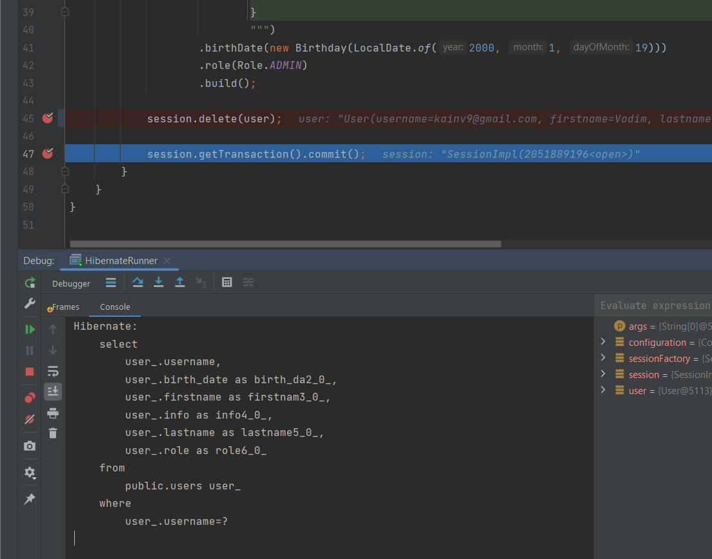
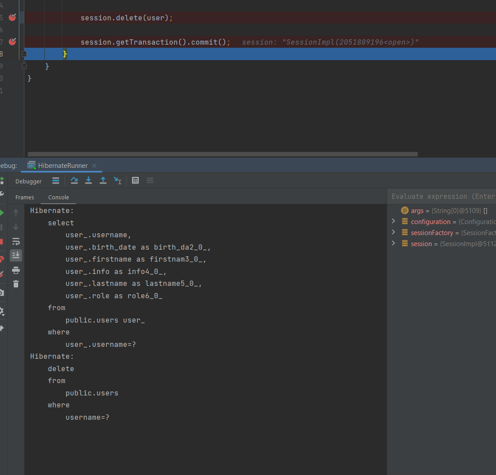
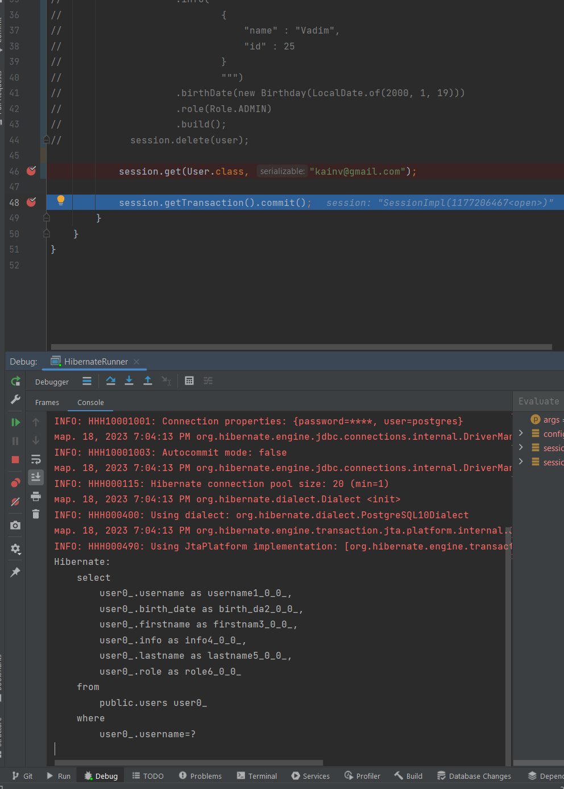

010 Методы update delete get
============================

Вернёмся к объекту `Session` и рассмотрим другие его методы потому что на текущий момент мы встречали только метод `session.save(entity)`. Разберёмся с методом `.update(entity)`.

update()
--------

Он обновляет нашего пользователя если он такой существует. Если такого пользователя не существует, то он пробрасывает exception. Это очень важно. Запустим `HibernateRunner` в дебаге предварительно указав username несуществующего пользователя:

Запускаем в дебаге, переходим к следующей точке и здесь есть второе важное замечание - никакого запроса в SQL не последовало в базу данных, хотя метод `update()` выполнился. Это очень важное замечание потому что на основании него мы приходим к одному выводу, что у hibernate отложенная отправка запросов. Он максимально старается отодвинуть тот момент, когда нужно открыть транзакцию и начать общаться с БД. Это все для оптимизации чтобы мы могли к примеру собрать несколько SQL запросов и отправить их батчем и т.д. Поэтому в нашем случае выполнится запрос только тогда, когда закоммитим нашу транзакцию либо не закроем нашу сессию.

Выполним запрос (перейдём к следующей точке) и получаем исключение, потому что такого юзера у нас нет в БД:

Если бы такой юзер был, то UPDATE прошел бы успешно. Если не хотим проверять, есть такой юзер или нет, т.е. нам нужно брать какой-то следующий запрос, получить юзера по ид и если его нет, то создать. В этом случае мы видели, что есть метод `.saveOrUpdate()`.

Запустим в дебаге также, почистим консоль и делаем следующий шаг. В этом случае идёт SELECT запрос. Т.е. для того чтобы, понять что нам делать: select или update - хайбернет делает запрос на получение этой сущности и дальше уже определяет, будет ли происходить insert либо update в какой-то момент времени, но точно до закрытия транзакции (но когда точно не можем сказать):

delete()
--------

Удаляем пользователя по его идентификатору. Это очень важно потому что у каждой сущности должен быть идентификатор. Т.е. поле, которое помечено аннотацией `@Id`. Нет такой сущности, которая не владеет ID. Следственно мы не можем нарушить первую нормальную форму SQL.

Вызовем дебаг, чистим консоль, делаем следующий шаг:

Опять видим, что выполнился select, но delete не последовал. Т.е. хайбернет помечает у себя, есть ли такая сущность действительно в БД или нет. Другими словами говоря - делает ли последующий запрос delete в какой-нибудь момент времени до закрытия транзакций либо во время неё. Т.е. опять же отложенный запрос на удаление. В данном случае у нас есть эта сущность. Следовательно, происходит delete:

Видим, что везде идет поиск по @Id.

Но в отличие от update, если такого пользователя нет в базах данных, то исключения не будет.

get()
-----

Т.е. как получить сущность по его идентификатору. Для этого должны передать `String entityName` или `Class<T> entityType`. Обычно используют второй вариант. Вторым полем передают идентификатор.

Запустим и посмотрим что произойдёт. Чистим консоль, переходим на следующий шаг и видим обычный select по идентификатору:

Все отработало успешно. Но тут есть два важных момента.

1.  Первый - почему по мимо идентификатора передаём нашу сущность - потому что с таким идентификатором могут быть разные таблицы и соответственно разные сущности. Поэтому уникальный ключ который у сессии получаем нашу сущность - это два поля: класс сущности и его идентификатор.

2.  Вторая интересная вещь в методе get() - это то, что он отличается от save delete update потому что в этом случае на методе get() мы наоборот преобразовываем из SQL в ООП модель, а не наоборот.

Поэтому, если зайдём в `HibernateRunnerTest`, то в методе `checkReflectionApi()` мы тестировали именно метод на save, когда устанавливали в PreparedStatement наши значения из полей. В этом случае у нас будет наоборот.

**HibernateRunnerTest.java**

    @Test
    void checkGetReflectionApi() throws SQLException, NoSuchMethodException, InvocationTargetException, InstantiationException, IllegalAccessException, NoSuchFieldException {
        PreparedStatement preparedStatement = null;
        ResultSet resultSet = preparedStatement.executeQuery();
        resultSet.getString("username");
        resultSet.getString("firstname");
        resultSet.getString("lastname");

        Class<User> userClass = User.class;

        Constructor<User> constructor = userClass.getConstructor();
        User user = constructor.newInstance();
        Field usernameField = userClass.getDeclaredField("username");
        usernameField.setAccessible(true);
        usernameField.set(user, resultSet.getString("username"));
    }

Данный код представляет собой эмуляцию работы метода session.get() из Hibernate для получения объекта User из базы данных по его идентификатору.

В первых трех строках кода выполняется запрос к базе данных, который возвращает объект ResultSet. Затем из этого объекта получаются значения полей username, firstname и lastname.

Далее, на основе класса User, полученного через переменную userClass, создается экземпляр класса User с помощью рефлексии. Для этого сначала получается конструктор по умолчанию через метод getConstructor(), а затем создается новый объект через вызов метода newInstance().

После этого получается поле username класса User с помощью метода getDeclaredField(). Затем устанавливается доступность этого поля с помощью метода setAccessible(), чтобы можно было присвоить ему значение из объекта ResultSet. Наконец, значение поля username объекта user устанавливается с помощью метода set().

Таким образом, данный код создает экземпляр класса User и устанавливает ему значение поля username, полученное из базы данных.