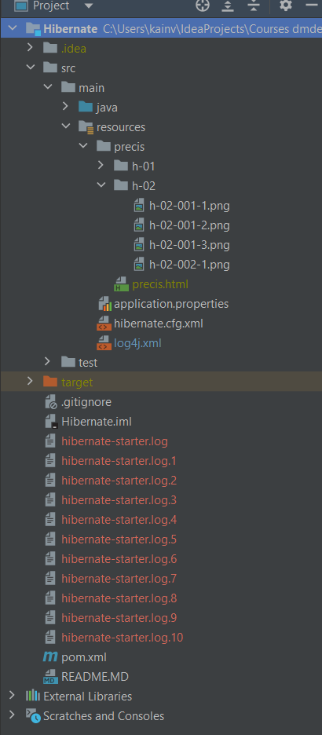
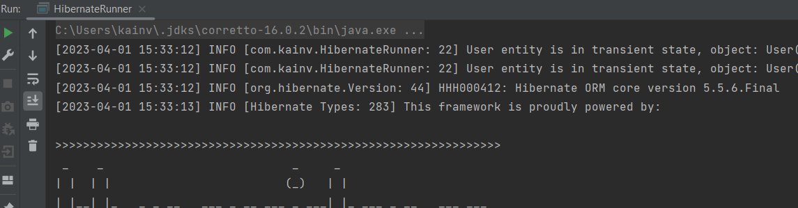
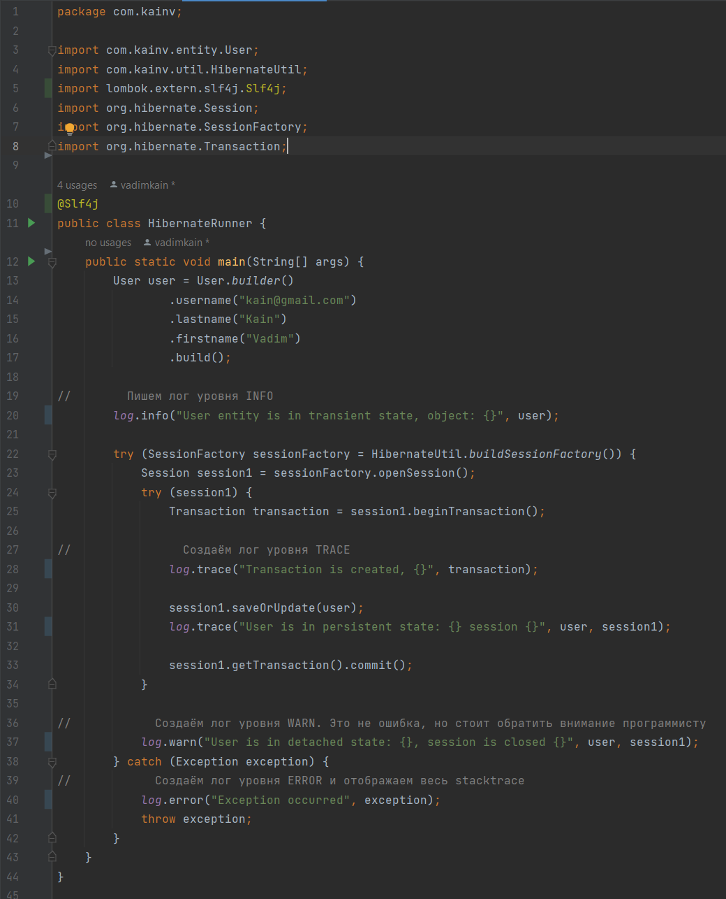

02 - 003 Logging. File appender
===============================

Наш log4j конфигурируется при помощи xml. Мы пока что воспользовались `<appender>`'ом, который выводил лог сообщений в консоль. Конечно же в консоль мы могли бы выводить и через `System.out.println()` без логирования. Мощь этих логов в том, что мы можем не только в консоли выводить, а куда угодно: базы данных, файлы, сеть. Это добавляется при помощи новых `<appender>`'ов. Например, если хотим вывести в файл, то добавляем новый `<appender>`, который уже является объектом `class="org.apache.log4j.RollingFileAppender"`. Мы ему дали название `name="filter"`. Следственно, если хотим чтобы наши сообщения выводились и в файл нужно в нашем `<root>` логгере указать новый `<appender-ref ref="file"/>`:

**log4j.xml**

    <?xml version="1.0" encoding="UTF-8" ?>
            <!DOCTYPE log4j:configuration SYSTEM "log4j.dtd">
    
    <log4j:configuration>
    
        <appender name="console" class="org.apache.log4j.ConsoleAppender">
            <param name="target" value="System.out"/>
    
            <layout class="org.apache.log4j.PatternLayout">
                <param name="ConversionPattern"
                       value="\[%d{yyyy-MM-dd HH:mm:ss}\] %p \[%c: %L\] %m%n"/>
            </layout>
        </appender>
    
        <appender name="file" class="org.apache.log4j.RollingFileAppender">
            <param name="file" value="hibernate-starter.log"/>
    
            <param name="append" value="true"/>
            <param name="maxFileSize" value="1KB"/>
            <param name="maxBackupIndex" value="10"/>
    
            <layout class="org.apache.log4j.PatternLayout">
                <param name="conversionPattern" value="\[%d{yyyy-MM-dd HH:mm:ss, SSS}\] %p \[%c: %L\] %m%n"/>
            </layout>
    
            <filter class="org.apache.log4j.varia.LevelRangeFilter">
                <param name="LevelMin" value="ALL"/>
            </filter>
        </appender>
    
        <root>
            <level value="INFO"/>
            <appender-ref ref="console"/>
            <appender-ref ref="file"/>
        </root>
    
    </log4j:configuration>

Далее, тут есть несколько параметров как у ConsoleAppender, это название файла ( `<param name="file" value="hibernate-starter.log"/>`), а точнее его путь где он будет лежать. Далее, что будет добавляться каждый раз новое сообщение (`<param name="append" value="true"/>`) после рестарта приложения, а не перетираться. Далее есть два интересных момента: maxFileSize проперти и maxBackupIndex. maxFileSize говорит про максимальный размер нашего файла. Если он достигает указанного размера, то создаёт новый файл. Этих файлов будет столько, сколько указали в maxBackupIndex. Следственно, как только доходим до 10 файлов - происходит роллинг (заново циклически продолжаем добавлять новые сообщения, а старые будут стираться). Далее, есть `<filter class="org.apache.log4j.varia.LevelRangeFilter">` который дополнительно фильтрует сообщения невзирая на то, что указывали в `<root>` (соответствующих логгерах).

Запустим еще раз приложение и увидим в нашей ROOT'овой директории проекта наши файлы:

Всё прошло ровно так, как мы указали в _log4j.xml_. Если откроем файл, то там будут видны логи. Их можно сохранить в БД по соответствующим ячейкам и далее искать нужный лог.

**Вернёмся** в _log4j.xml_. Кроме нескольких `<appender>`'ов может быть и несколько `<root>`'ов (логгеров). Т.е. рутовый логгер он один и самый главный и он не может не быть, но также можно добавить свои:

Название логгера определяется по пакету который хотим отслеживать. Я хочу отслеживать _com.kainv_ поэтому пишем `<logger name="com.kainv">`. Теперь все лог сообщения который сделали в этом пакете в любом из классов будут попадать в этот логгер.

**log4j.xml**

    <!--    Логгер. Определяем пакет в котором хотим отслеживать логи -->
    <logger name="com.kainv">
        <!--        Указываем уровень с которого логируем-->
        <level value="info"/>
        <!--        Указываем аппендер -->
        <appender-ref ref="console"/>
    </logger>

    <!--    Тоже логгер, но главный -->
    <root>
        <level value="info"/>
        <appender-ref ref="console"/>
        <appender-ref ref="file"/>
    </root>

Запустим HibernateRunner еще раз и видим, что появилось дублирование:

Это происходит потому что создали два логгера, которые отслеживают лог-евенты и отправляют соответствующим аппендерам. А так как и тот, и тот логгер отправляет одному и тому же аппендеру - мы видим на консоли эти сообщения два раза. Это происходит потому что у логгеров тоже есть parent-child зависимости или т.н. иерархия. Следовательно, `<root>` он на то и root как класс Object в java, от него наследуются все логгеры. Следственно, если хотим чтобы сообщения не дублировали при иерархии, то добавляем новое свойство `<logger name="com.kainv" additivity="false">`. В таком случае с _additivity="false"_ мы не будем дублировать сообщение, если другой логгер в нашей иерархии также его отображает.

Как еще определяется иерархия? По пакетам. Мы можем создать ещё один логгер, который будет отслеживать пакет _com.kain.entity_:

**log4j.xml**

    <!--    Логгер. Определяем пакет в котором хотим отслеживать логи -->
    <logger name="com.kainv" additivity="false">
        <!--        Указываем уровень с которого логируем-->
        <level value="info"/>
        <!--        Указываем аппендер -->
        <appender-ref ref="console"/>
    </logger>

    <logger name="com.kainv.entity" additivity="false">
        <level value="info"/>
        <appender-ref ref="console"/>
    </logger>

        <!--    Тоже логгер, но главный -->
    <root>
        <level value="info"/>
        <appender-ref ref="console"/>
        <appender-ref ref="file"/>
    </root>

Получается, что пакет entity находится в _com.kainv_, а в _com.kainv_ тоже есть логгер. Поэтому для этого логгера (_com.kainv.entity_) родителем будет _com.kainv_. Поэтому если отобразим сообщение по одному и тому же аппендеру, то будет дублирование. Поэтому используем additivity="false" в таком случае. Но на практике редко используют много логгеров (например, ConsoleAppender нужен только во времся разработки, в продакшене в нем нет нужны).

Ещё один момент это то, что в lombok мы можем использовать соответствующую аннотацию чтобы не дублировать константу `public static final Logger log = LoggerFactory.getLogger(HibernateRunner.class);` из класса в класс. Эта аннотация называется `@Slf4j` которая сгенерирует такую же строку:

