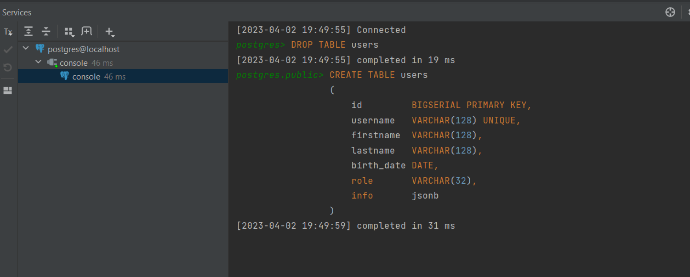
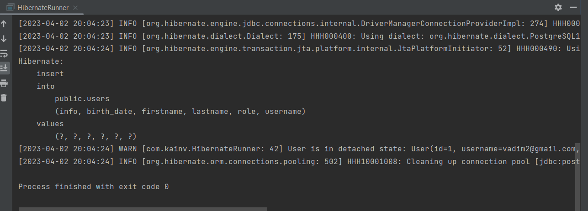
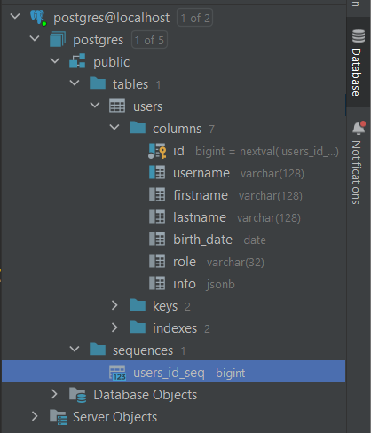
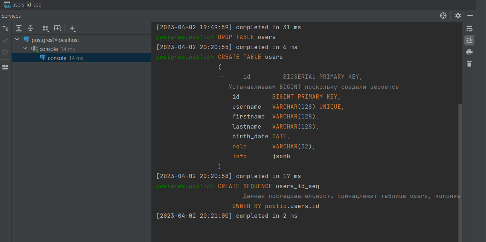
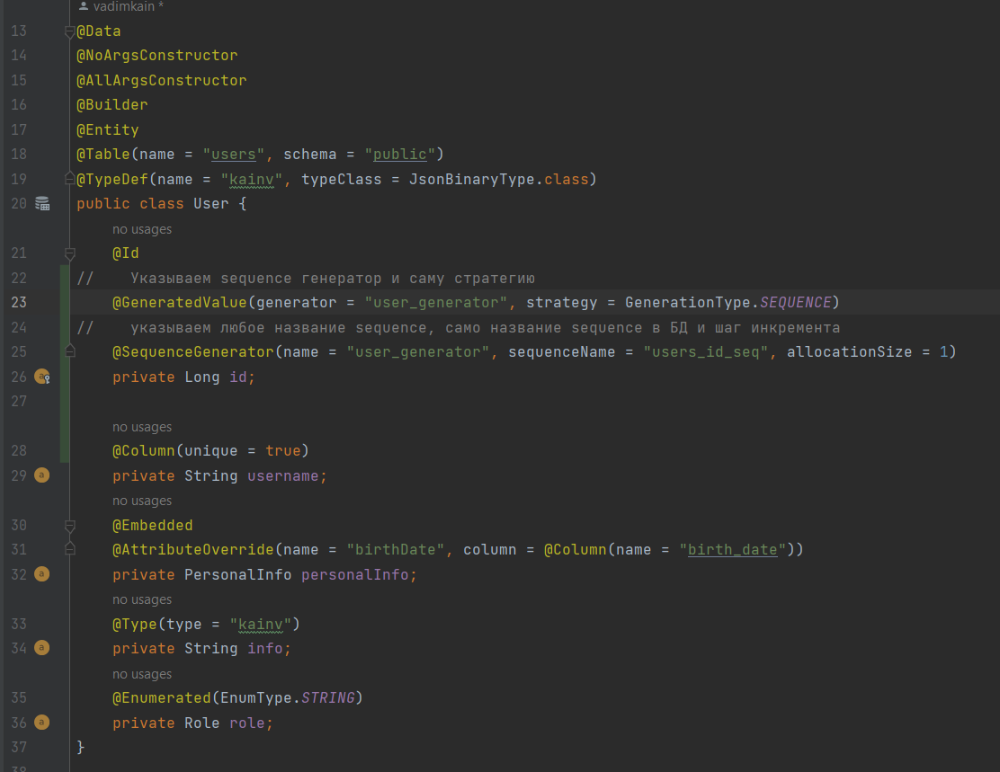
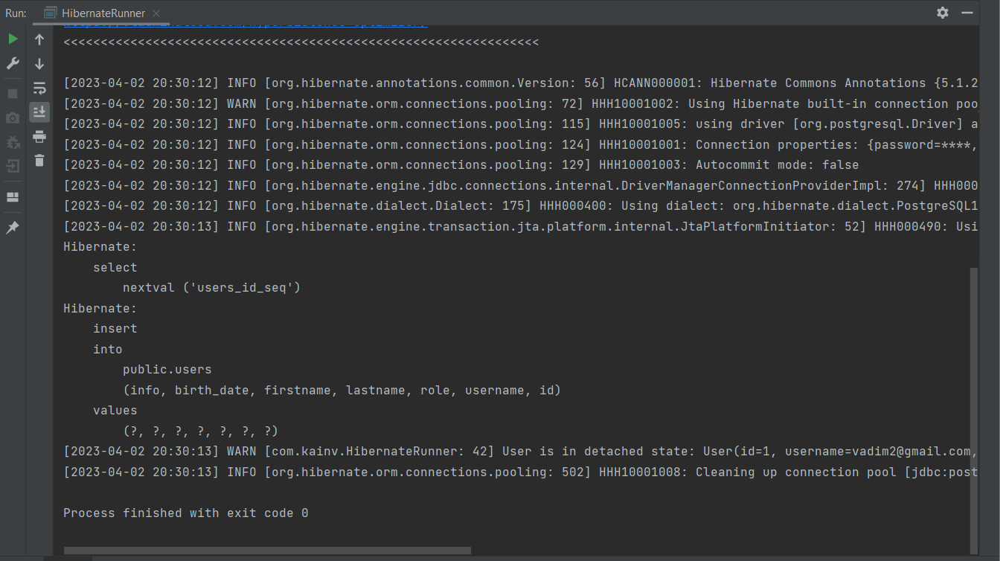
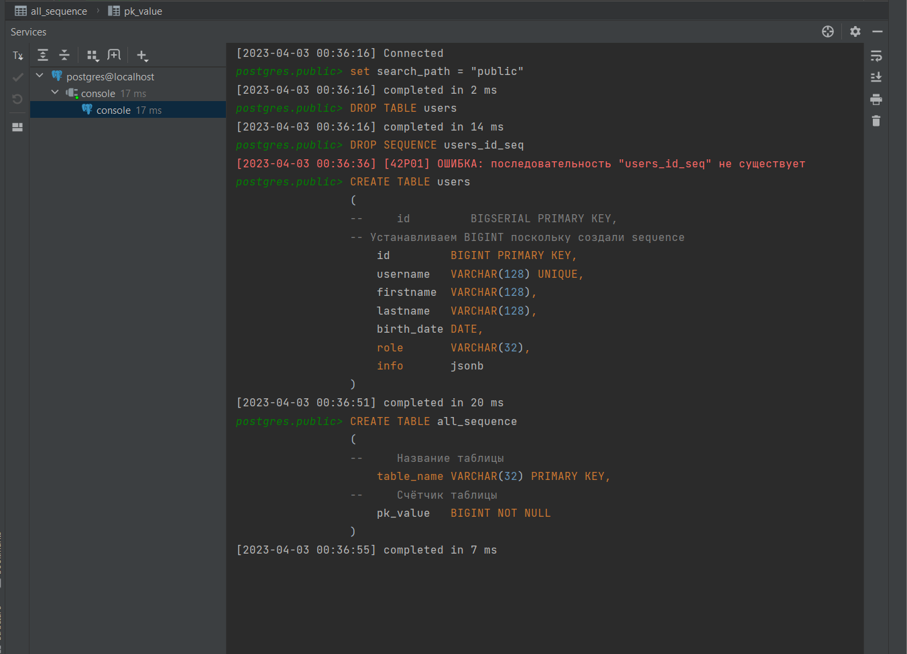
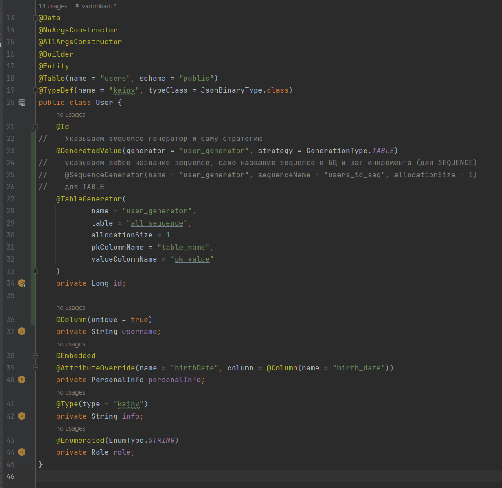
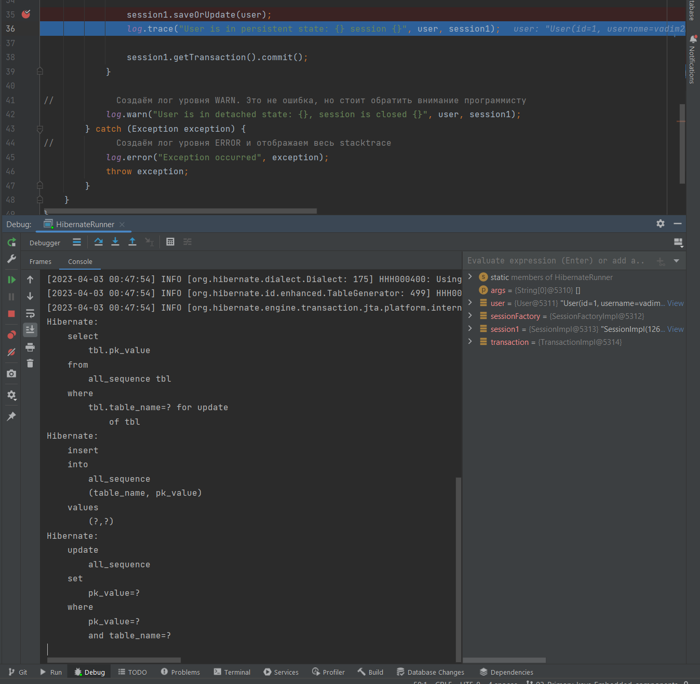

03 - 002 Primary keys
=====================

Разберёмся с первичными ключами. Т.е. такие первичные ключи как в нашем случае (String username) не так часто встречается потому что с ними много проблем как минимум в производительности потому что hibernate лучше работает с автогенерируемыми первичными ключами, а вторым - очень сложно менять бизнес-логику с первичными ключами которые натуральные.

Зайдём в нашу SQL консоль и для пользователя добавим автогенерируемый IDшник:

    CREATE TABLE users
    (
        id         BIGSERIAL PRIMARY KEY,
        username   VARCHAR(128) UNIQUE,
        firstname  VARCHAR(128),
        lastname   VARCHAR(128),
        birth\_date DATE,
        role       VARCHAR(32),
        info       jsonb
    );

Дропнем таблицу users и опять создадим:

Теперь, наш String username это обычная колонка. Можно даже указать, что она unique = true (на самом деле это наша метаинформация чтобы разработчики видели, что колонка уникальная). Такая метаинформация может использоваться и, для того чтобы сгенерировать автоматически DDL.

Далее, создаём первичный ключ `private Long id`, но в этот раз уже недостаточно просто аннотации `@Id` потому что мы должны Hibernate сказать чтобы он не вставлял это поле в базу данных иначе он будет требовать чтобы идентификатор был не null. Тогда мы должны поставить аннотацию `@GeneratedValue(strategy = )` и указать в стратегии соответствующее значение. Есть четыре различных вариантов:

*   `GenerationType.AUTO` - использует либо **IDENTITY** либо **SEQUENCE** либо **TABLE** в зависимости от выбранной СУБД и от выбранного диалекта. В случае postgresql это **SEQUENCE**. Диалект указываем в _hibernate.cfg.xml_, в `<property name="hibernate.dialect">`.

*   `GenerationType.IDENTITY`

    В нашем случае когда база данных сама ответственна за генерацию id'шника (потому что поставили BIGSERIAL) следственно наша правильная конфигурация это `@GeneratedValue(strategy = IDENTITY)`. Именно эта настройка чаще всего встречается в приложениях. Он побеждает и при производительности в работе с Hibernate и по простоте.

                @Data
                @NoArgsConstructor
                @AllArgsConstructor
                @Builder
                @Entity
                @Table(name = "users", schema = "public")
                @TypeDef(name = "kainv", typeClass = JsonBinaryType.class)
                public class User {
                    @Id
                    @GeneratedValue(strategy = GenerationType.IDENTITY)
                    private Long id;

                    @Column(unique = true)
                    private String username;
                    @Embedded
                    @AttributeOverride(name = "birthDate", column = @Column(name = "birth\_date"))
                    private PersonalInfo personalInfo;
                    @Type(type = "kainv")
                    private String info;
                    @Enumerated(EnumType.STRING)
                    private Role role;
                }

Вернёмся в HibernateRunner и там поменяем username чтобы он был уникальный и ещё раз запустим HibernateRunner:

Как видим, всё выполнилось. Данные вставились в таблицу users, но idшник не указан потому что нам не нужно указывать т.к. **база данных сама отвечает** за идентификатор.

Теперь, если зайдём в таблицу users, то увидим пользователя которого вставили с правильным id. **Мы должны предпочитать именно такой вариант первичных ключей**.

*   `GenerationType.SEQUENCE` - т.е. когда используется последовательность. Это ещё один тип в СУБД наравне с таблицами, view и т.д. просто называется SEQUENCE. Это аналог обычного счётчика. Т.е. который просто содержит какое-то значение и автоматически инкриминируется после каждого вызова. Они есть не во всех базах данных, например в MySQL таких последовательностей нет.

    

    Видим user\_id\_seq. Это и есть sequence который автоматически создался когда создавали наш идентификатор BIGSERIAL. Он даже указывает как он получает следующее значение из этого sequence (есть и другие функции для работы с sequence, например для обнуления или получения текущего значения без инкремента). Т.е. вызывается встроенная функция nextval('user\_id\_seq') в которую передаётся название sequence.

    Мы также можем создать sequence сами. Зайдём в консоль и создадим свой sequence:

                CREATE TABLE users
                (
                --     id         BIGSERIAL PRIMARY KEY,
                -- Устанавливаем BIGINT поскольку создали sequence
                    id         BIGINT PRIMARY KEY,
                    username   VARCHAR(128) UNIQUE,
                    firstname  VARCHAR(128),
                    lastname   VARCHAR(128),
                    birth\_date DATE,
                    role       VARCHAR(32),
                    info       jsonb
                );

                DROP TABLE users;

                CREATE SEQUENCE users\_id\_seq
                --     Данная последовательность принадлежит таблице users, колонке id
                    OWNED BY public.users.id

Удалим таблицу users, создадим таблицу и последовательность для неё:

Возвращаемся в класс User и теперь нам надо указать эту sequence в нашем идентификаторе. Если не укажем, то он будет искать SEQUENCE по умолчанию 'hibernate\_sequence' (если бы мы автогенерировали DDL, то hibernate его создал бы):

Запускаем HibernateRunner и видим, что перед тем как вставить в нашу таблицу вызывается _select nextval('users\_id\_seq')_ для того чтобы потом во время insert в нашу таблицу установить этот id'шник потому что сейчас мы сами отвечаем за этот id'шник и передаём его в базу данных. Таблица не знает какой id к ней придёт.

Ещё один интересный момент. Дело в том, что в случае Transient сущностей для того чтобы она стала Persistent - в ней должен быть установлен IDшник. Это главное обязательное требование. До того как мы использовали `@GeneratedValues()` мы использовали натуральные ключи. Следовательно, наши запросы отправлялись в базу данных только когда делали `session.flush()` или `session.getTransaction().commit();`. Следовательно, сейчас сначала вызывается _select nextval()_ чтобы у сущности был IDшник (мы не можем не иметь ID у Persistence сущности потому что он используется для нашего first level cache). Только после `session.getTransaction().commit();` мы увидим запрос на _insert_.

*   `GenerationType.TABLE` - используется реже всего. Только в том случае если база данных не поддерживает автогенерируемых IDшников или последовательностей. TABLE использовали до того как изобрели sequence и автогенерируемые ключи.

    **В чем суть TABLE?** Идём в консоль и создаём эту самую таблицу:

                CREATE TABLE all\_sequence
                (
                --     Название таблицы
                    table\_name VARCHAR(32) PRIMARY KEY,
                --     Счётчик таблицы
                    pk\_value   BIGINT NOT NULL
                );

Именно такую таблицы должны предоставить в случае стратегии TABLE. Это что-то вроде костыля в случае отсутствия sequence и автогенерируемых ключей. Эта таблица будет хранить для всех таблиц их текущее значение первичного ключа.

Удалим таблицы _users\_id\_seq_ и _users_. Создадим заново _users_ и _all\_sequence_:

Идём в класс User и вместо @SequenceGenerator должны использовать `@TableGenerator()` в котором делаем все то же самое:

Теперь, если запустим HibernateRunner в дебаге, то на шаге после saveOrUpdate() увидим следующее:

Сначала вызвался _select_. Это пессимистическая блокировка строки которая вернулась на этот запрос. Естественно в первом случае у нас не было такой записи в all\_sequence следственно мы её вставляем при помощи _insert_. Вставляет в all\_sequence название нашей таблицы и её pk\_value. Далее происходит _update_, т.е. устанавливаем новое значение (инкриминируем) где берём предыдущее значение (проверяем double check что оно не изменилось). Таким образом в нашей сущности теперь есть идентификатор. Опять же в Hibernate для Persistence state нам не нужно делать _insert_, нам главное получить ID из сущности. Следовательно, только когда закоммитим транзакцию или сделаем flush произойдёт запрос в базу данных на _insert_ в нашу таблицу users.

На самом деле flush и commit это не единственные варианты когда hibernate сбрасывает dirty контекст. Теперь в таблице all\_sequence видим значение 1. Раньше так и делали до создания первычных ключей и последовательностей.