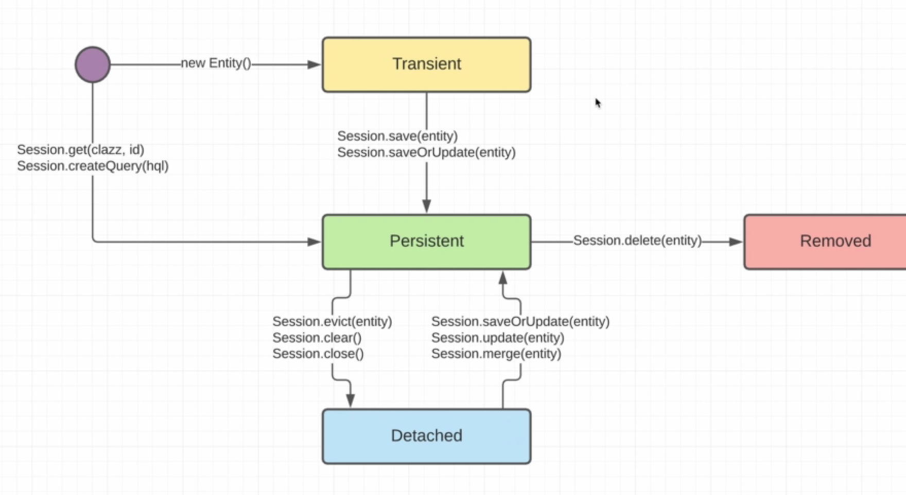

013 Entity lifecycle. Теория
============================

Теперь мы знаем, что у каждой сессии (объекта класса `Session`) есть свой кэш и мы увидили что это всего лишь ассоциативный массив, где ключом является ID сущности и её EntityPersister, а значением - сама эта сущность. И именно на основании этого `PersisterContext`'а определяется состояние наших сущностей. Оно может быть разным в зависимости от сессий потому что в одной сессии сущность может быть проассоциирована, а в другой нет. Как ассоциировать `PersisterContext` мы уже знаем - мы обязаны сделать какой-то запрос в базу данных. Без запроса в базу данных эта сущность не попадает в наш `PersisterContext`.

Отсюда у нас вытекает жизненный цикл наших сущностей. Т.е. как та или иная сущность ассоциирована с каждым конкретным объектом типа `Session`. И у каждых из этих сущностей есть четыре основных состояния:

1.  **Transient**

2.  **Persistent**

3.  **Removed**

4.  **Detached**

В каждую из этих состояний можем попасть всего лишь вызвав соответствующий метод у нашей `Session`.

Вначале (фиолетовая точка), например какой-то метод (в нашем случае это метод main) мы создаём создаём сущность (`new Entity`). Т.е. в данном случае это будет **Transient**. Она ни с какой сессией не ассоциирована, соответственно это transient. Для того чтобы проассоциировать transient сущность с сессией и её `PersistenceContext`'ом мы должны у `Session` вызвать метод `save(entity)` или `saveOrUpdate(entity)`.

Тогда её состояние переходит в **Persistent**, а persistent что сущность проассоциирована с `PersistenceContext` нашей сессии. Опять же в зависимости от того, у какого объекта типа `Session` мы вызвали метод `save()` или `saveOrUpdate(entity)`, именно с тем объектом будет проассоциирован наша сущность. Именно для того объекта сессии будет сущность в состоянии **Persistent**. Так же мы видили, что можем использовать методы `Session.get(Class, id)` или `Session.createQuery(hql)` для того чтобы делать свои специальные запросы с помощью hql (это что-то вроде специального языка запроса, только для hibernate). И в таком случае те сущности, которые нашли с помощью этих методов также переходят в состояние persistent и помещаются в наш кэш (`PersistenceContext`). Так же видели, что когда делали метод `Session.update(entity)` он тоже помещался в **Persistent**, но мы также видели что выполнялся неявно метод `Session.get()`. Т.е. мы обязаны получить эту сущность из базы данных, для того чтобы проассоциировать её с нашим `PersistenceContext`'ом и далее мы уже могли выполнить метод `Session.update()`.

Далее, мы могли у сессии вызвать метод `Session.delete()` и в таком случае наша сущность удаляется из кэша (другими словами говоря из `PersistenceContext`) и переходит в состояние **Removed** и будет удалена из базы данных когда закроем сессию или вызовем метод `Session.flush()`. _Напоминание: у hibernate отложенный вызов методов_. Следовательно, если хотим раньше выполнить запрос в базу данных на удаление наших сущностей, то мы обязаны сделать метод `Session.flush()` либо закрыть нашу сессию.

Последнее состояние это **Detached** в которое можем попасть просто вызвав метод `Session.evict(entity)` or `Session.clear()` or `Session.close()`. Т.е. мы удаляем нашу сущность/очищаем кэш/закрываем сессию из нашего `PersistenceContext`. Получается, что **Detached** отличается от _Transient_ тем, что detached-сущность была когда-то проассоциирована с какой-то сессией и именно для неё она уже является detached. Но мы можем вернуть её в _Persistent_ состояние если у сессии вызовем `Session.saveOrUpdate(entity)` or `Session.update(entity)` or `Session.merge(entity)`. Но в любом из этих случаев все равно неявно вызывается метод `Session.get()` для того чтобы получить сущность как она есть из базы данных и далее ассоциировать с уже готовой сущностью которая у нас есть на уровне приложения.