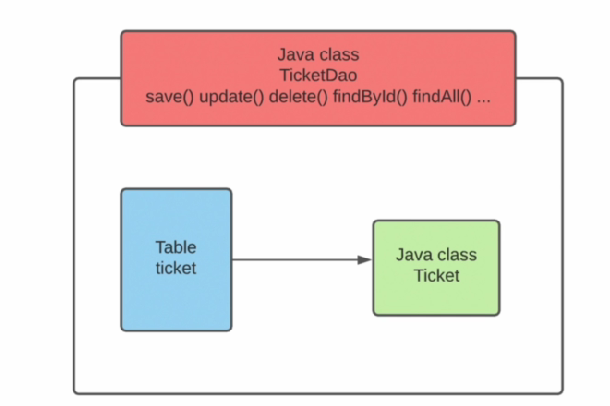
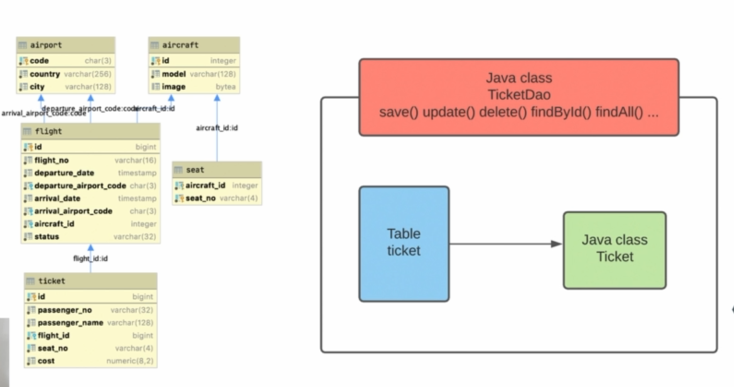
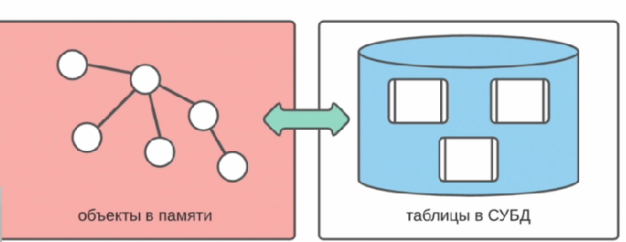
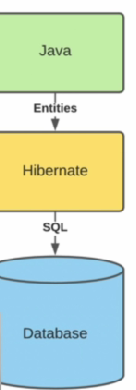

001 Введение
============

Какие проблемы при использовании JDBC?
--------------------------------------

1.  **Несоответствие двух моделей**

    

    Всё дело в том, что у нас есть несоответствие двух моделей. Т.е. ООП модель в java, где объекты в памяти и объекты взаимодействуют друг с другом. С другой стороны - у нас есть реляционная модель СУБД, где все хранится на жестком диске в виде таблиц и взаимодействие этих таблиц происходит при помощи foreign key'ев и это большая проблема, потому что модели совершенно разные и взаимодействие конкретных элементов тоже разное.

    В итоге, нам приходилось создавать свою таблицу на которую мы map'пили соответствующий java-класс и именно процесс маппинга (преобразования) табличных данных в java классы и соответствующие их объекты очень трудоемкий процесс, особенно преобразования различных типов, связий между таблицами и т.д.

2.  **Ручное описание простейших SQL запросов**

    

    У нас очень частые операции CRUD и поэтому нам необходимо было каждый раз писать для соответсвующих таблиц свой класс и на маппинг из таблиц в классы и наоборот из классов в таблицы - мы писали свой слой DAO и повторяли одни и те же основные запросы. Мы каждый раз дублировали практически один и тот же код, те же самые запросы и преобразование типы данных java в SQL и наоборот. Это рутинная работа и забирает довольно много времени у программиста.

3.  **Отложенная загрузка данных (Lazy loading)**

    

    Дело в том, что если мы например создадим класс Ticket на соответствующую таблицу ticket и так же заходим создать класс Flight на соответствующую таблицу flight. То если мы вдруг захотим в объекте типа Flight создать список на все тикеты (которые к нему относятся), а в тикете будет ссылка на flight, к которому он относится - то, следовательно, у нас будет бесконечная рекурсия, когда захотим достать flight. flight достанет все ticket'ы, а ticket опять достанет flight, к которому он относится и поехало всё по кругу. В итоге нам необходимо было бы **lazy loading** который опять же есть в hibernate по умолчанию.

4.  **Множество других более мелких проблем**. Такие как наследование в классах, сравнение объектов (по первичному ключу в СУБД и equals в Java), кэширование, управление транзакциями.

ORM
---

Из этих проблем выводим такое понятие как **ORM**. **ORM (Object Relational Mapping)** - процесс преобразования объектно-ориентированной модели в реляционную и наоборот.

Т.е. по сути то, что делали на JDBC, но делали это в ручную при помощи маппинга. Чтобы не писать все это каждый раз в ручную у нас есть **Hibernate**.

Hibernate
---------

**Hibernate** - это инструмент, который автоматизирует процесс преобразования объектно-ориентированной модели в реляционную и наоборот (ORM Framework).

Вместо JDBC у нас будет Hibernate и для общения с БД мы будем создавать соответствующие сущности Entities. И все что нам необходимо будет сделать - это познакомиться с инструментами Hibernate, его аннотациями, внутренним устройством который поможет нам автоматизировать весь процесс ORM.