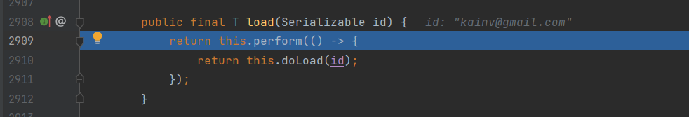

011 EntityPersister
===================

Более подробно остановимся на методе `session.get()` и как он получает нашу сущность всего лишь по идентификатору переданной сущности и классу сущности.

Для начала запустим в режиме дебага и запустим внутрь метода get:

Как видим, entityClass используется, для того чтобы передать в метод `byId` того же класса `session` и далее `byId` возвращает какой-то объект, у которого вызываем метод `.load(id)` который возвращает сущность по его идентификатору.

Разберёмся что за `byId(entityClass)`, зайдём внутрь и видим что по entityClass нам возвращается объект типа `IdentifierLoadAccessImpl`.

Если зайдём в конструктор этого класса, то увидим что он используется для того чтобы вернуть нам `EntityPersister`:

А `EntityPersister` получается из мета-модели:

Т.е. `.getFactory()` - это наш `SessionFactory`, далее из этой фабрики сессии получается мета-модель. Эту мета-модель мы уже неоднократно использовали. Т.е. в `HibernateRunner` когда добавляем `configuration.addAnnotatedClass(User.class);`, который кладёт этот класс в метод `metadataSources` и тоже самое с нашими _BasicType_'ами. Т.е. все типы которые добавляем в `Configuration` так или иначе оказываются в мета-дате. Мета-дата - это всего лишь информация об информации. Следовательно, она хранит всю информацию о наших типах, сущностях и прочее.

Следовательно, если посмотрим на `getFactory().getMetamodel()`, то в `entityPersisterMap` увидим нашу сущность. Т.е. по названию этот `"com.kainv.entity.User"` хранит объект типа `SingleTableEntityEntityPersister`. Этот класс является основной реализацией класса `EntityPersister`. Именно он занимается тем, что загружает, обновляет, удаляет из баз данных нашу сущность. Следовательно, это своего рода маппинг между реляционной моделью и объектно-ориентированной.

Так же есть `typeConfiguration`, который хранит все наши типы в `basicTypeRegistry`. Наш недавно добавленный JSON так же тут есть:

Поэтому мета-модель по entityClass'у возвращает нам `EntityPersister`, который занимается тем, что маппит соответствующий SQL запросы с нашей сущностю.

Возвращаемся в точку остановы (мы получили `IdentifierLoadAccessImpl`) и далее с помощью него вызываем метод `.load()` потому что это всего лишь `EntityPersister` и он уже знает как загружать в память соответствующую сущность. Поэтому сколько у нас сущностей будет столько и будет соответствующих `EntityPersister`'ов:

**В итоге у нас получается следующая модель:**

Наш один единственный объект на всё приложение `SessionFactory`, в нём есть `MetaModel`, которая строится на основании тех классов, тех сущностей которые мы туда добавили и плюс все типы `BasicTypes` которые также можем добавить сами либо которые добавляются по умолчанию с помощью Hibernate для стандартных типов данных. И далее, на каждые сущности которые также обязаны иметь @Id идентификатор (это ключевой момент понимания того, как устроен Hibernate) так же маппятся на `EntityPersister`. Т.е. у каждой сущности свой `EntityPersister` и он знает как выполнять соответствующие запросы, например CRUD для наших сущностей. Т.е. проебразовывает нашу объектную модель в реляционную (обычные SQL запросы). Все просто :)

 

Так же для внимания: когда вызывается метод `doLoad`, то в hibernate все построено на event'ах и listener'ах. Они были очень-очень распространены довольно давно когда ещё были десктопные приложения и например на щелчёк по кнопке так же срабатывал listener и обрабатывал соответствующее действие. То же самое и в браузерах. Такую же методологию использует Hibernate для всех методов. Т.е. и для получения сущности по идентификатору и для обновлений, и для сохранений и для обновлений. На каждый из них есть свой соответствующий listener. Каждый из этих listener'ов слушает соответствующее событие.

Теперь зная как устроена мета-модель в SessionFactory и что каждая сущность соответствуют EntityPersister, мы готовы переходить к пониманию First Level Cache, т.е. как устроен кэш в Hibernate.