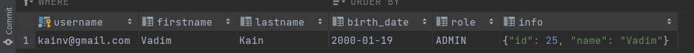

009 Custom user type
====================

В 008 мы разобрались как создавать свои собственные конвертеры, для того чтобы использовать свои какие-то типы данные, на которые у Hibernate нет соответствующих базовых типов. Но что если в SQL есть какой-то необычный тип данных который даже не знаем как представить в виде SQL типа потому что в нашем случае, в `BirthdayConverter` у нас был какой-то java.sql.Date и мы уже на основании его преобразовывали свой собственный тип. А если такого типа не будет в SQL, то нам нужно работать с каким-то массивом байт. Что уже конвертером не обойтись и уже в таком случае нам придется создавать свой собственный тип данных реализуй InterfaceType или UserType.

Добавим новое поле в таблицу. Какая-нибудь информация в виде JSONB. Это нестандартный тип данных, который есть в postgresql и нет аналога в java sql типе. Следственно, нам необходимо будет создавать свой тип данных и преобразовывать его из массива байт.

    CREATE TABLE users
    (
        username   VARCHAR(128) PRIMARY KEY,
        firstname  VARCHAR(128),
        lastname   VARCHAR(128),
        birth\_date DATE,
        role       VARCHAR(32),
        info       jsonb
    );

Теперь попробуем создать свой собственный тип и посмотрим что это будет из себя представлять:

    package com.kainv.type;

    import org.hibernate.HibernateException;
    import org.hibernate.engine.spi.SharedSessionContractImplementor;
    import org.hibernate.usertype.UserType;

    import java.io.Serializable;
    import java.sql.PreparedStatement;
    import java.sql.ResultSet;
    import java.sql.SQLException;

    public class JsonType implements UserType {
        @Override
        public int\[\] sqlTypes() {
            return new int\[0\];
        }

        @Override
        public Class returnedClass() {
            return null;
        }

        @Override
        public boolean equals(Object o, Object o1) throws HibernateException {
            return false;
        }

        @Override
        public int hashCode(Object o) throws HibernateException {
            return 0;
        }

        @Override
        public Object nullSafeGet(ResultSet resultSet, String\[\] strings, SharedSessionContractImplementor sharedSessionContractImplementor, Object o) throws HibernateException, SQLException {
            return null;
        }

        @Override
        public void nullSafeSet(PreparedStatement preparedStatement, Object o, int i, SharedSessionContractImplementor sharedSessionContractImplementor) throws HibernateException, SQLException {

        }

        @Override
        public Object deepCopy(Object o) throws HibernateException {
            return null;
        }

        @Override
        public boolean isMutable() {
            return false;
        }

        @Override
        public Serializable disassemble(Object o) throws HibernateException {
            return null;
        }

        @Override
        public Object assemble(Serializable serializable, Object o) throws HibernateException {
            return null;
        }

        @Override
        public Object replace(Object o, Object o1, Object o2) throws HibernateException {
            return null;
        }
    }

Методов очень много и их очень сложно переопределять. Но самое главное это то что у нас есть `Object nullSafeGet(ResultSet resultSet, String[] strings, SharedSessionContractImplementor sharedSessionContractImplementor, Object o)`. Т.е. когда из ReusltSet получаем что-то что будет являться нашим JSON'ом либо наоборот: `void nullSafeSet(PreparedStatement preparedStatement, Object o, int i, SharedSessionContractIm.plementor sharedSessionContractImplementor)`. Т.е. когда есть PreparedStatement и Object o и этот объект мы должны будем установить в PreparedStatement. Это два основных метода.

Есть и другие методы, которые нужно переопределить чтобы все работало. К счастью, уже есть готовые библиотеки которые мы просто можем подключить в свой проект и используя их JSON типы которые точно также реализуют UserType либо просто Type для того чтобы не писать это все вручную. Эта библиотека называется **hibernate types**. Подключим её:

        <!-- https://mvnrepository.com/artifact/com.vladmihalcea/hibernate-types-52 -->
        <dependency>
            <groupId>com.vladmihalcea</groupId>
            <artifactId>hibernate-types-52</artifactId>
            <version>2.12.1</version>
        </dependency>

Так же нам надо ещё подключить slf4:

    <!-- https://mvnrepository.com/artifact/org.slf4j/slf4j-api -->
    <dependency>
        <groupId>org.slf4j</groupId>
        <artifactId>slf4j-api</artifactId>
        <version>1.7.32</version>
    </dependency>

Теперь идём в наш класс `User` и добавляем нашу колонку info в виде строки. Так же как в случае с конвертером нам нужно указать новый тип и зарегистрировать его в хайбернете. Для этого есть специальная аннотация которая называется `@Type(type = )` и передаём туда полный путь к классу который будем использовать в качетсве типа для нашего info. Для Json в подключаемой библиотеке есть два основных класса: это `JsonStringType` и `JsonBinaryType`. Binary для JSONB т.е. когда у нас колонка представляется в виде массива байт, а JsonStringType - когда в SQL используется просто JSON тип, а не JSONB и он хранится как строка:

    @Data
    @NoArgsConstructor
    @AllArgsConstructor
    @Builder
    @Entity
    @Table(name = "users", schema = "public")
    public class User {
        @Id
        private String username;
        private String firstname;
        private String lastname;
    //    @Convert(converter = BirthdayConverter.class)
        @Column(name = "birth\_date")
        private Birthday birthDate;
        @Type(type = "com.vladmihalcea.hibernate.type.json.JsonBinaryType")
        private String info;
        @Enumerated(EnumType.STRING)
        private Role role;
    }

Этого недостаточно. Мы должны его зарегистрировать в Configuration при помощи `registerTypeOverride()`:

    public class HibernateRunner {
        public static void main(String\[\] args) {
            Configuration configuration = new Configuration();
    //        configuration.setPhysicalNamingStrategy(new CamelCaseToUnderscoresNamingStrategy());
    //        configuration.addAnnotatedClass(User.class);
            configuration.addAttributeConverter(new BirthdayConverter());
            configuration.registerTypeOverride(new JsonBinaryType());
            configuration.configure();

            try (
                    SessionFactory sessionFactory = configuration.buildSessionFactory();
                    Session session = sessionFactory.openSession()
            ) {
                session.beginTransaction();

                User user = User.builder()
                        .username("kainv@gmail.com")
                        .firstname("Vadim")
                        .lastname("Kain")
                        .birthDate(new Birthday(LocalDate.of(2000, 1, 19)))
                        .role(Role.ADMIN)
                        .build();

                session.save(user);

                session.getTransaction().commit();
            }
        }
    }

Добавим какую-нибудь информацию к нашему пользователю:

    public class HibernateRunner {
        public static void main(String\[\] args) {
            Configuration configuration = new Configuration();
    //        configuration.setPhysicalNamingStrategy(new CamelCaseToUnderscoresNamingStrategy());
    //        configuration.addAnnotatedClass(User.class);
            configuration.addAttributeConverter(new BirthdayConverter());
            configuration.registerTypeOverride(new JsonBinaryType());
            configuration.configure();

            try (
                    SessionFactory sessionFactory = configuration.buildSessionFactory();
                    Session session = sessionFactory.openSession()
            ) {
                session.beginTransaction();

                User user = User.builder()
                    .username("kainv@gmail.com")
                    .firstname("Vadim")
                    .lastname("Kain")
                    .info("""
                            {
                                "name" : "Vadim",
                                "id" : 25
                            }
                            """)
                    .birthDate(new Birthday(LocalDate.of(2000, 1, 19)))
                    .role(Role.ADMIN)
                    .build();

                session.save(user);

                session.getTransaction().commit();
            }
        }
    }

Запустим `HibernateRunner` и посмотрим что получится:

На самом деле, если зайдём в `JsonBinaryType` и в случае подобных типов можно записывать более лаконичные названия потому что в них есть методы `String getName()` которые так же можем использовать для того чтобы не указывать полный путь. Это всего лишь метод из нашего Type который переопределяет `JsonBinaryType` вместо того чтобы мы это делали сами. Поэтому, идём в наш `User` и указываем `@Type(type = "jsonb")`:

**User.java**

    @Type(type = "jsonb")
    private String info;

Если же мы не дали такое лаконичное название для своей колонки, то есть ещё одна аннотация, которая называется `@TypeDef()` (можно ставить не только над классом, но и над пакетом) в которую передаём лаконичное название и тип класса, который будем преобразовывать. Например:

    @Data
    @NoArgsConstructor
    @AllArgsConstructor
    @Builder
    @Entity
    @Table(name = "users", schema = "public")
    @TypeDef(name = "kainv", typeClass = JsonBinaryType.class)
    public class User {
        @Id
        private String username;
        private String firstname;
        private String lastname;
    //    @Convert(converter = BirthdayConverter.class)
        @Column(name = "birth\_date")
        private Birthday birthDate;
        @Type(type = "kainv")
        private String info;
        @Enumerated(EnumType.STRING)
        private Role role;
    }

Довольно сложно описывать свои типы данных и гораздо проще поискать в интернете уже готовые библиотеки которые представляют специальные классы для работы с какими-то нестандартными типами данных в базах данных потому что каждая из СУБД имеет какие-то свои нестандартные свойства или не специфичные типы данных которые захотим использовать в приложении.