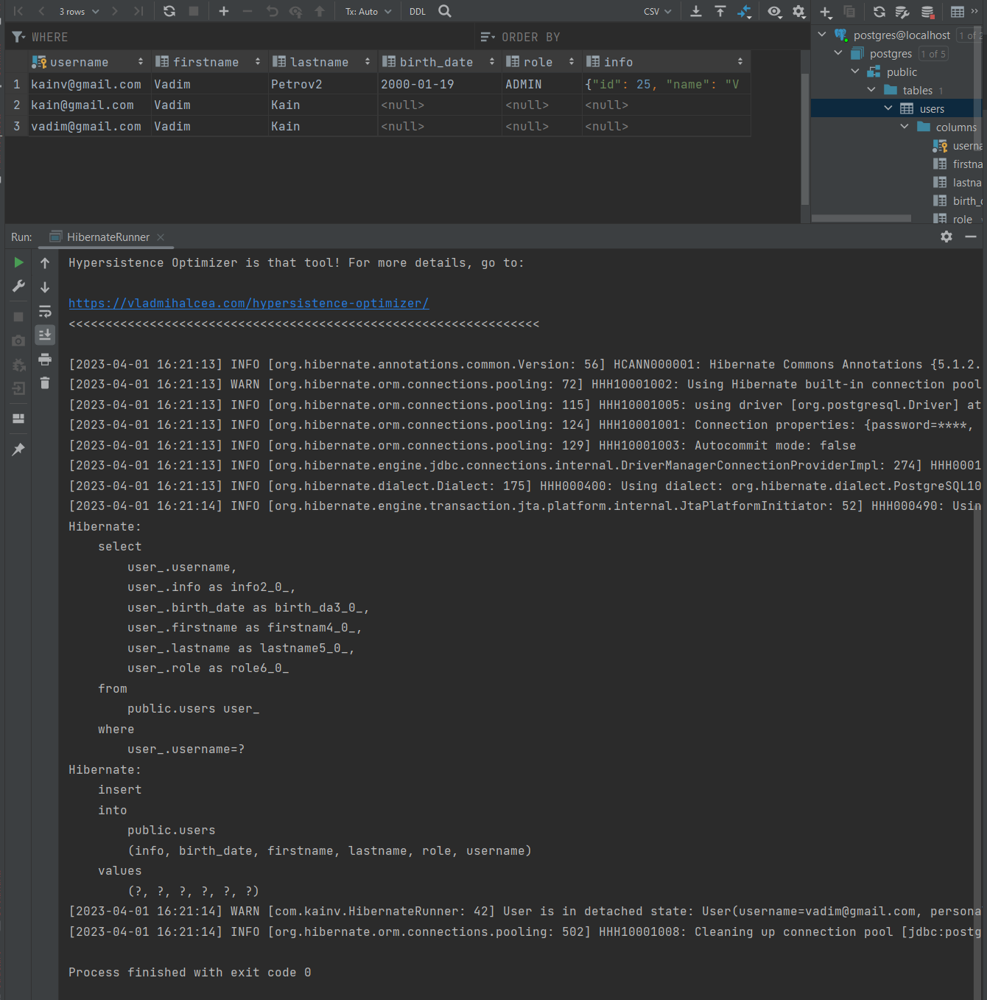

03 - 001 Embedded components
============================

Дело в том, что часто на уровне java мы работает со сложными объектами, которые внутри себя содержат другие поля. И, следовательно, мы можем захотеть объединить некоторые поля сущностей (к примеру firstname, lastname) в одно поле (например personal\_information), но т.к. в SQL мы не хотим создавать какой-то встраиваемый тип который не все СУБД могут поддерживать. Следовательно, проще создать объекты на уровне java, а в SQL оставить все как есть. Или, например, в легаси базах данных очень часто есть составные первичные ключи, а следовательно вторичные которые необходимо также объединять в отдельные объекты, для того чтобы работать как с одним ключем.

Объединим три поля: firstname, lastname, birthDate в какой-то встраиваемый компонент. Для этого создадим класс `PersonalInfo` в пакете _com.kainv.entity_ и вставим туда три поля:

    package com.kainv.entity;

    import javax.persistence.Column;

    public class PersonalInfo {
        private String firstname;
        private String lastname;
        //    @Convert(converter = BirthdayConverter.class)
        @Column(name = "birth\_date")
        private Birthday birthDate;
    }

Здесь все те же правила, что и у обычных сущностей (должен быть конструктор без параметров, не должен быть immutable, должны быть геттеры и сеттеры и т.д.. Следовательно, Повторяем здесь все те же lombok аннотации:

    package com.kainv.entity;

    import lombok.AllArgsConstructor;
    import lombok.Builder;
    import lombok.Data;
    import lombok.NoArgsConstructor;

    import javax.persistence.Column;
    import javax.persistence.Embeddable;

    @Data
    @NoArgsConstructor
    @AllArgsConstructor
    @Builder
    // @Embeddable говорит о том, что это встраиваемый компонент
    @Embeddable
    public class PersonalInfo {
        private String firstname;
        private String lastname;
        //    @Convert(converter = BirthdayConverter.class)
        @Column(name = "birth\_date")
        private Birthday birthDate;
    }

Все аннотации, которые использовали в сущностях - все те же самые аннотации можно использовать и во встраиваемых компонентах.

Теперь, идём в User и здесь хотим вместо этих трёх полей использовать встраиваемый компонент. Поэтому пишем:

    @Data
    @NoArgsConstructor
    @AllArgsConstructor
    @Builder
    @Entity
    @Table(name = "users", schema = "public")
    @TypeDef(name = "kainv", typeClass = JsonBinaryType.class)
    public class User {
        @Id
        private String username;
        @Embedded
        private PersonalInfo personalInfo;
        @Type(type = "kainv")
        private String info;
        @Enumerated(EnumType.STRING)
        private Role role;
    }

В HibernateRunner поправляем нашу сущность:

**HibernateRunner.java**

        User user = User.builder()
                .username("vadim@gmail.com")
                .personalInfo(
                        PersonalInfo.builder()
                                .lastname("Kain")
                                .firstname("Vadim")
                                .build()
                )
                .build();

Запустим HibernateRunner и проверяем что это также работает:

Видим, что все прошло успешно.

Как это работает?
-----------------

На самом деле всё просто. Зайдём в класс `Configuration` и там всё сводится к нашим `private List<BasicType> basicTypes;`. Т.е. к тем типам данным, которые добавляются по умолчанию в хайбернете. Если зайдём в интерфейс `Type`, от которого наследуется `BasicType`, то найдем реализацию `EmbeddedComponentType`. Этот тип отвечает за embedded компоненты. Он наследуется от `ComponentType`. В этом классе на каждый из встраиваемых типов создаётся объект типа `ComponentType` и для многих других типов используется двухфазовая инициализация. Т.е. сначала вызывается метод `hydrate()`:

.... который из ResultSet получает все необходимые значения по колонкам String\[\] которые есть в нашем embedded компоненте. Далее, как только извлекли все значения из ResultSet при получении из БД - вызывается метод `resolve()`:

Это уже второй шаг и мы уже получаем наш массив всех значений соответствующих колонок и на основани этого массива мы уже создаём соответствующую сущность. Т.е. это при чтении. А при сохранении в базу данных нужно наоборот: трансформировать embeddable компонент в соответствующие поля в базах данных. Это будет `nullSafeSet()`:

Где у нас есть PreparedStatement и мы из нашего Object value устанавливаем соответствующие значения.

Но тут есть один маленький момент. А что если поля в `User` несоответствуют полям в `PersonalInfo`? Т.е. например у нас не firstname, а first\_name. Для примера в `PersonalInfo` над полем `private Birthday birthDate;` уберём аннотацию `@Column(name = "birth_date")`:

    @Data
    @NoArgsConstructor
    @AllArgsConstructor
    @Builder
    // @Embeddable говорит о том, что это встраиваемый компонент
    @Embeddable
    public class PersonalInfo {
        private String firstname;
        private String lastname;
        //    @Convert(converter = BirthdayConverter.class)
        private Birthday birthDate;
    }

И теперь, если бы в `HibernateUtil` не было установлены `configuration.setPhysicalNamingStrategy(new CamelCaseToUnderscoresNamingStrategy());` то нужно было бы указать birthDate через нижнее подчеркивание. Поэтому, в `User` можем использовать соответствующую аннотацию `@AttributeOverrides()` в которой должны указать название проперти в embedded компоненте и настоящую колонку в нашей сущности User:

    @Data
    @NoArgsConstructor
    @AllArgsConstructor
    @Builder
    @Entity
    @Table(name = "users", schema = "public")
    @TypeDef(name = "kainv", typeClass = JsonBinaryType.class)
    public class User {
        @Id
        private String username;
        @Embedded
        @AttributeOverride(name = "birthDate", column = @Column(name = "birth\_date"))
        private PersonalInfo personalInfo;
        @Type(type = "kainv")
        private String info;
        @Enumerated(EnumType.STRING)
        private Role role;
    }

Таких @AttributeOverride можно делать бесконечно. Такие компоненты встречаются довольно часто особенно в случае легаси баз данных где у нас много составных первичных ключей. Хотя лучше использовать синтактические генерируемые первичные ключи.