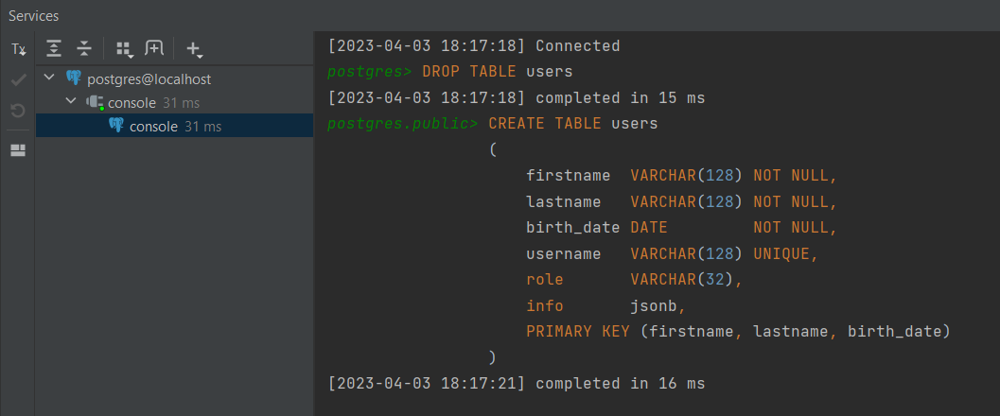

03 - 003 EmbeddedId
===================

В легаси базах данных можно встретить сложные составные ключи когда первичный ключ, а следовательно и вторичные ключи могут состоять из нескольких полей. Например, у нас есть `PersonalInfo` где три поля и мы можем встретить в каких-то базах данных где эти все три поля будут являться первичным ключом в нашей таблице `User`. Как делать в таком случае?

Для начала подправим структуру таблиці. Т.е. удалим автогенерируемый idшник и у нас будет сразу три поля являться составным первичным ключом (firstname, lastname, birth\_date):

    CREATE TABLE users
    (
        firstname  VARCHAR(128) NOT NULL,
        lastname   VARCHAR(128) NOT NULL,
        birth\_date DATE         NOT NULL,
        username   VARCHAR(128) UNIQUE,
        role       VARCHAR(32),
        info       jsonb,
        PRIMARY KEY (firstname, lastname, birth\_date)
    );

Удалим нашу таблицу users и создадим её заново:

Идём в сущность `User`. Теперь наш `private PersonalInfo personalInfo;` должен быть первичным ключом. У нас должна быть сущность которая помечена аннотацией `@Id`, следовательно, это у нас будет сущность `PersonalInfo`. Но **составное первичный ключ не может быть помечен как `@Id`**, это будет неправильно. На самом деле у нас есть другая аннотация: `@EmbeddedId`. Т.е. когда встраиваемая сущность используется в качестве идентификатора:

Теперь начинаем поправлять `PersonalInfo` потому что как мы знаем есть несколько ограничений для того чтобы класс был первичным ключом. Как минимум это то, что **это поле должно быть `Serializable`** (потому что поля помеченные как идентификатор должны быть сериализируемыми). Мы видели, что Serializable поле находится в качестве ключа для first level cache, но и дальше будем проходить second level cache и там уже действительно используется сериализация и десериализация первичного ключа. Следственно, мы должны реализовать этот интерфейс (`public class PersonalInfo implements Serializable`). Как мы помним, желательно переопределить `serialVersionUID` для тех классов, которые реализуют интерфейс Serializable:

Теперь перейдём в HibernateRunner и подправим User user добавив ещё одно обязательное поле так как оно входит в наш первичный составной ключ (birth\_date):

    public class HibernateRunner {
        public static void main(String\[\] args) {
            User user = User.builder()
                    .username("vadim3@gmail.com")
                    .personalInfo(
                            PersonalInfo.builder()
                                    .lastname("Kain")
                                    .firstname("Vadim")
                                    .birthDate(new Birthday(LocalDate.of(2000, 1, 2)))
                                    .build()
                    )
                    .build();

    //        Пишем лог уровня INFO
            log.info("User entity is in transient state, object: {}", user);

Теперь, самое интересное не после того как сохранили нашего user, но и как нам получать этого юзера по такому сложному первичному ключу. Для начала создадим ещё одну сессию в которой будем билдить ключ после чего у сессии получим наш класс через `session.get(User.class, key);` и посмотрим что увидим на консоли:

 

Выполнился запрос на то, чтобы проверить есть ли такая сущность в базах данных потому что в данном случае у пользователя именно EmbeddedId (т.е. не автогенерируемый) поэтому если бы сделали просто save(), то не произошло бы никакого запроса в базу данных, а так Hibernate проверил есть ли такая сущность и стоит ли в следующий раз делать update или insert в базу данных. И только после того как сделаем flush() или commit() транзакции произойдёт непосредственно insert:

Далее, делаем _select_ и видим, что user2 у нас получился:

На практике **не советуют** использовать такие первичные составные ключи. С ними гораздо усложняется работа и это не только на уровне Dao, но и на других слоях приложения. Следует всегда предпочитать IDENTITY.