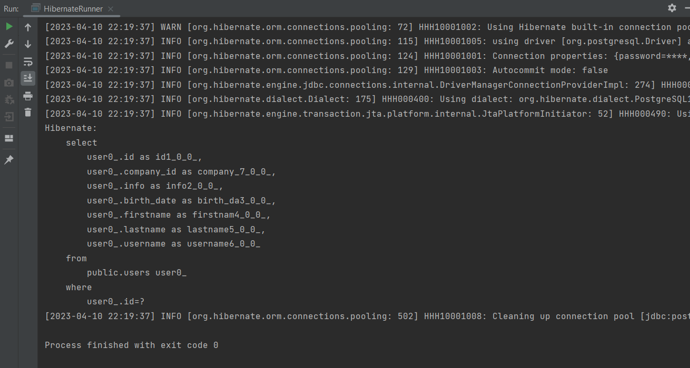

04 - 002 Fetch types
====================

Поговорим немного про запросы. Как hibernate делает дополнительные join'ы или отдельные запросы, для того чтобы достать нашу отдельную сущность, на которую сделали маппинг ассоциацию. По умолчанию мы видели _left outer join_ на нашу компанию. А как мы знаем, _left outer join_ работает не так быстро как например _inner join_ или, возможно захотим сделать отдельный запрос в таблицу company для того чтобы получить его по id'шнику. И на каждый из этих кейсов у hibernate есть функционал. Все зависит от того, что нам действительно нужно по бизнес-логике.

Например, зайдём в `User` и попробуем заменить _left outer join_ на _inner join_. И, как мы знаем, если сделаем _inner join_, то те юзеры, у которых нет компаний тоже отсеются и скорее всего мы такое не захотим. **Но если** у нас стоит на _company\_id_ ограничение _NOT NULL_, то **лучше** для производительности сделать _inner join_. Для этого мы видели, что у `@ManyToOne()` есть свойство `optional`, который по умолчанию true, но можем сделать false. И в таком случае это будет _NOT NULL_ ограничение и мы будем обязаны устанавливать _company\_id_ в нашу сущность.

В `HibernateRunner` получим пользователя по id:

 

Видим, что выполнился _inner join_. Для того чтобы выполнить отдельный запрос на получение company (такое тоже может пригодиться, особенно когда будем проходить проблему N+1) идём в `User` и устанавливаем в `@ManyToOne(optional = false, fetch = FetchType)` значение `fetch`, которое по умолчанию установлено в режиме `FetchType.EAGER` (жадный тип выборки). Можем изменить тип выборки на `FetchType.LAZY` (ленивый тип выборки) (у нас есть два варианта - EAGER и LAZY). По умолчанию для обычных объектов установлено EAGER, для коллекций это LAZY.

Выполним `HibernateRunner` с lazy типом выборки:

Как видим, в этот раз вообще не было запроса на компанию. Т.е. мы увидели всего лишь запрос на таблицу user по id'шнику.

**Как так произошло?** Для этого зайдём в `HibernateRunner` и в дебаге поставим брейкпоинт на коммит транзакции и ещё раз запустим:

Открываем объект нашего пользователя и видим, что компания действительно все таки установлена. Т.е. объект не null как в случае info или role. Но видим не company класс, а какой-то **Company$HibernateProxy$....**. Это всего лишь прокси-класс который создаётся динамически во время выполнения и на этапе компиляции такого класса нет. Если его откроем, то увидим, что этот класс очень похож на обычный класс `Company` с полями id и name, но ещё с дополнительным **$$\_hibernate\_interceptor**'ом. Как раз благодаря прокси и их реализаций у нас есть возможность инициализировать нашу Company только тогда, когда попросим поля у нашей сущности Company.

В консоли видим, что выполнился _select_ на company, хотя это не просили делать. Все потому у нас переопределен метод toString(), а в дебаге этот toString() естественно вызывается для отображения.

Поэтому зайдём в `User` и явно при помощи lombok переопределим метод toString():

Теперь наш дебаг при отображении сущности `User` не вызовет toString() у всех полей включая company, а следственно если вызываем toString() у company, мы также инициализируем наш прокси. Ещё раз запустим и проверим:

Видим, что второй _select_ на company не выполнился. Но как только мы выполним действие на получение информации о компании, то Hibernate сделает запрос на таблицу company:

Это очень интересный механизм про который поговорим позже.

Под итожим, что в маппинге ManyToOne и не только есть `FetchType` (**тип выборки**), который бывает LAZY (ленивый) и EAGER (жадный). Именно FetchType нам позволяет сразу же получать сущности дополнительные на которые мы завязаны и таким образом делать соответствующие _left join_ или _inner join_ в зависимости от того, установлен ли `optional` в true или false. Поэтому таким образом можем сами оптимизировать наши запросы, но опять же есть множество проблем связанных с LAZY инициализацией потому что мы можем инициализировать так коллекцию только тогда, когда есть доступ к текущему соединению (т.е. к текущей открытой сессии) и транзакции в которой выполняем запросы. Иначе может быть ошибка LAZY инициализации.