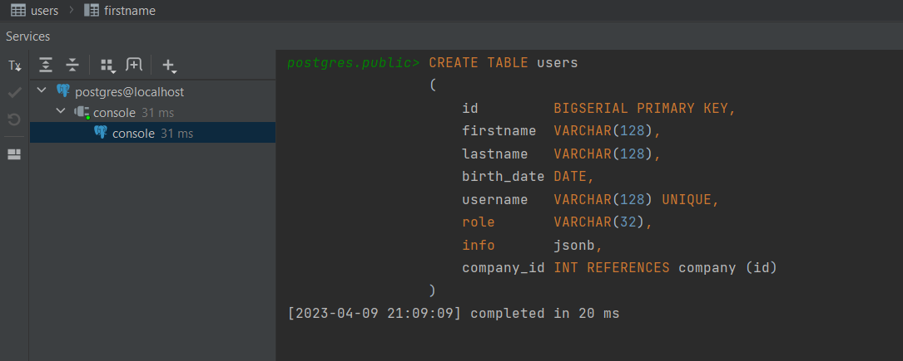

04 - 001 ManyToOne
==================

Начнём с самой первой ассоциации - это many to one. Для примера мы просто создадим таблицу компании и наши пользователи будут работать в какой-то компании. Следовательно, множество юзеров будут относится к одной компании, поэтому это и _ManyToOne_.

Напоминание: есть только 4 маппинга ассоциаций:

1.  ManyToOne

2.  OneToMany

3.  OneToOne

4.  ManyToMany

В Hibernate есть соответствующие маппинги на уровне java. Это нам необходимо сделать ORM когда реляционную модель с её ассоциациями маппим на соответствующую объектную модель в Java.

Для начала создадим таблицу **company**:

И теперь добавляем id компании в таблицу **user**:

Теперь идём на уровень модели нашей в entity. Для начала подправим подправим `User`. Уберём embeddable ключ (т.е. уберём аннотацию `@EmbeddedId`) и добавим свой синтаксический id. И, для того чтобы ссылаться на компанию на компанию мы должны создать ещё одну сущность `Company`:

 

Аннотация `@Table()` необязательна потому что у нас название сущности совпадает с названием нашей таблицы. Так как SQL не чувствителен к регистру, следовательно неважно что у нас класс начинается с большой буквы.

Теперь, в `User` мы должны указать компанию, на которую ссылается пользователь. В JDBC мы бы написали `private Integer companyId`, но нам намного удобнее оперировать с объектами в java, а не с примитивными типами или их обертками. Следовательно, мы хотим вместо первичного ключа использовать нашу сущность. Следовательно, указываем какой маппинг используем аннотацию, которая указывает на то, какую связь используем (`@ManyToOne`). **И второе поле** `@JoinColumn(name = "")` в которой указываем название колонки в таблице которая используется для нашего маппинга (есть так же другие поля, читать документацию). Но @JoinColumn необязателен для использования потому что если не укажем его, то по умолчанию будет использовать следующее: название сущности с маленькой буквы и через нижнее подчеркивание первичный ключ.

**Зайдём в** `HibernateRunner` и подправим наш код. Удалим все ненужное, укажем компанию и выполним `session.save()`. Перед тем как сохранить нашего юзера - мы должны сохранить нашу компанию. Это точно такая самостоятельная сущность, как и user. Следовательно, сначала должны выполнить `session1.save(company);`, и только потом `session1.save(user);` потому что для пользователя необходим _company\_id_, а он установится в сущности company только после того как мы для этой сущности вызвали метод session.save(). Это все можно будет упростить когда пройдём _Cascade Type_.

Осталось зарегистрировать сущность company в _hibernate.cfg.xml_ или в `HibernateUtil` классе когда делали `configuration.addAnnotatedClass(Entity.class)`.

Теперь запускаем в дебаге `HibernateRunner`:

Видим insert. Более того, видим что вставилась наша компания (company\_id). И в нашей сессии, в нашем кэше уже две сущности. Один для company и другой для user:

Точно также будет когда будем получать пользователя по id'шнику. В alt+f8 во время дебага почищим (`session.clear()`) кэш и вызовем session.get:

Получаем нашего юзера и компанию. Более того, видим соотвествующий select, который сделал hibernate:

Видим, что сделал автоматически _left join_ на нашу компанию. Почему он сделал _left join_, а не отдельный запрос в БД на получение company по id - это уже второе поле в аннотации `@ManyToOne`, а именно `fetch`.

**Как это работает.** Мы знаем, что в hibernate есть basic-types, которые есть по умолчанию. И есть соответствующий маппинг, который называется `ManyToOneType` и именно этот тип когда видит соответствующую аннотацию (`@ManyToOne`) занимается соответствующими запросами в базу данных. Здесь есть все те же методы, как и в других типах данных. Например, так же есть `hydrate()` для инициализации, `resolve()` на получение сущностей и соответствующие методы на установку когда сохраняем в базу данных наш company\_id. Hibernate сам извлекает его идентификатор и сохраняет в базу данных.