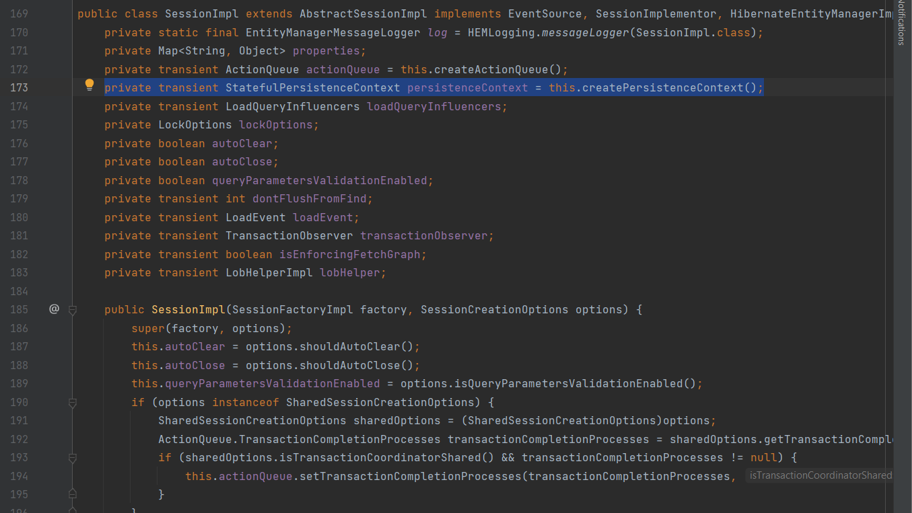
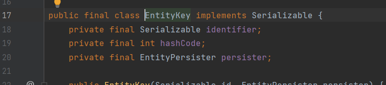

012 First Level Cache
=====================

Именно **EntityPersister** отвечает за операции над соответствующей своей сущностью и преобразует объектную модель в реляционную и наоборот. И именно класс нашей сущности является ключом, по которму получаем из мета-модели наш EntityPersister. И уже далее по нему мы можем получить данные о нашей сущности используя его id. Он является важным классов в понимании того как устроен **first level cache**. Чтобы проверить это - два раза получим нашего юзера по одному и тому же id. Запустим в дебаге и посмотрим что получится:

**HibernateRunner.java**

        User user1 = session.get(User.class, "kainv@gmail.com");
        User user2 = session.get(User.class, "kainv@gmail.com")
        session.getTransaction().commit();

Предварительно почистим консоль, сделаем запрос для user1 и user2 перейдя к шагу с коммитом:

Как видим, второй запрос не выполнился. Все потому что это и есть кэш. В hibernate реализованы механизмы кэширования наших сущностей, а следственно меньше раз заходим в БД и делаем SQL запросы. Этот кэш называется ещё **first level cache**, т.е. кэш первого уровня. И он есть всегда по умолчанию и никак его не отключить. Если зайдём в наш объект `session` в дебаге, то в ней есть `persistenceContext` поле. Именно его называют как **first level cache**.

Зайдём в реализацию интерфейса `Session`, который называется как `SessionImpl` (это также видим в дебаге) и чуть ниже видим поле `private transient StatefulPersistenceContext persistenceContext = this.createPersistenceContext();`:

А основной интерфейс это `PersistenceContext`, в котором есть ссылка на сессию, к которой принадлежит (`private SharedSessionContractImplementor session;`), это тоже **очень важное** замечание потому что на каждую сессию есть свой `PersistenceContext`. Если у нас несколько сессий, то у каждой из них будет свой `PersistenceContext`:

И далее, основные поля его, это Map - ассоциативные массивы. Т.е. это и есть наш кэш, где по ключу (`EntityKey`) мы получаем нашу сущность (`Object`):

Открываем `EntityKey` и видим, что это identifier (т.е. уникальный ключ), поэтому он должен быть `Serializable`, но это не только ограничение в типе данных `EntityKey`, но и в том чтобы реализовывать **second level cache**. Так же видим `EntityPersister`, т.е. класс который ответственен за CRUD операции наших сущностей и как мы знаем, мы можем получить его из мета-модели.

Следовательно, если откроем `pesistenceContext` в дебаге, то видим `entitiesByKey`, т.е. наш ассоциативнй массив в котором уже лежит наша сущность по ключу `identifier="kainv@gmail.com"`, лежит `EntityPersister` который отвечает за сущность User и само `value`:

Следовательно, если в нашем кэше (`persistenceContext`'е) есть сущность по нашему ключу, то, следовательно, нам не нужно отправлять запрос в базу данных и мы просто берём его из нашего ассоциативного массива. **Так как же он попадает туда?**.

Это происходит через вызовы наших методов у `Session`. Другими словами говоря, только после обращения к базе данных мы можем положить сущность в наш `PersistenceContext`. Т.е. это будет либо метод `save()`, либо метод `get()` либо ещё другие методы. Все они кладут в `PersistenceContext` сущность после того как они сделали запрос в базу данных. Т.е. должно быть обязательное соответствие с базой данных. Другими словами говоря, `PersistenceContext` является проекцией на нашу текущую базу данных, а точнее на её состояние в данный момент времени, когда открыли нашу сессию и начали делать запросы к нашей базе данных.

**А если все таки захотим удалить из `PersisenceContext` сущность?** Для этого у сессий так же есть несколько методов:

1.  `session.evict(Object object)` - т.е. вызываем этот метод, передаём туда сущность и он удаляет её из кэша.

2.  `session.clear()` - в данном случае чистим весь наш кэш. Т.е. весь наш ассоциативный массив. И какие бы там сущности не были - все они будут удалены из кэша потому что в случае с `evict()` удаляем один единственный объект.

3.  `session.close()` - закрываем сессию. Или когда просто выходим из нашего try-with-resources блока.

Для примера вызовем `evict()`:

И смотрим что в дебаге что размер `entitiesByKey` равен нулю. Т.е. удалили эту сущность из нашего кэша:

На практике довольно редко используется удаление. Обычно мы просто закрываем соединение и возвращаем запрос нашему пользователю и на этом сессия прекращает свое выполнение. Тем не менее надо знать, что такие методы существуют.

**Далее есть следующий очень важный момент, который связан с `PersistenceContext`**. Это то, что как только получили нашего пользователя - дальнейшие изменения с этой сущностью, которая уже связаны с `PersistenceContext`'ом **обязательно** отразится в запросах базы данных. Т.е. например подправим у user его lastname и не делаем никаких методов `update()`, просто изменяя через `setLastname()` и всё. Посмотрим что получится:

 

Коммитим транзакцию и в консоли видим метод UPDATE, который сделал hibernate. Хотя мы никакого `update()` не вызывалиЖ

В итоге, если зайдём в нашу базу данных, то увидим изменения. Отсюда **делаем вывод**: все сущности которые ассоциированы с нашей сессией, другими словами говоря, лежат в `PersistenceContext`'e нашего first level cache - все изменения этих сущностей по любому отразятся в запросы в базу данных и такое понятие ещё называется **_dirty session_**. Т.е. когда в рамках нашей сессии мы изменяем сущности, которые ассоциированы с этой сессией. Таким образом делаем её грязной. Следственно все таки изменения так или иначе отразятся в SQL запросах. Это так же легко проверить с помощью специального метода `session.isDirty()`. Если зайти в метод, то в комментарии будет написано: _если сессия содержит какие либо изменения, то они обязательно будут синхронизированы с базой данных_. Поэтому сущности надо осторожно изменять которые уже лежат в кэше (`PersistenceContext`'e). Так же указано про _flushed_, т.е. когда изменения в объектах сливаем в БД (делаем соотвествующие SQL запросы) и именно это называется _flush_. Этот метод мы так же можем вызвать: `session.flush()`. Это будет тоже самое, т.е. мы сливаем состояние нашего first level cache в базу данных (делаем соответствующие запросы).

Поэтому все что мы измениили на текущий момент до того как вызвали метод `session.flush()` - все это будет отправлено в виде SQL запросов в нашу базу данных. Изменим ещё раз lastname и запустим в дебаге. Получим пользователя и выполним метод `session.flush()`:

Обращаем внимание на консоль. Как только вызвали метод `session.flush()` - происходит синхронизация с базами данных и все изменения в нашем `PersistenceContext`'е (он же кэш) будут отправлены в базу данных в качестве SQL запросов, для того чтобы синхронизироваться с ней. Поэтому здесь надо быть очень **аккуратным**.

Если об этом говорить схематично, то это выглядит следующим образом:

 

У нас есть `SessionFactory`, в которой есть мета-модель и в ней есть множество наших сессий, объектов типов Session. Это что-то типа session-пула. У каждой из этих сессий есть свой `PersistenceContext`, т.е. свой кэш. Это так же является **очень важным** в понимании жизненого цикла сущности потому что каждая сущность может быть ассоциирована с разными сессиями и для каждой из этих сессий будет свое состояние сущности. Нужно понимать, что каждая сущность может быть в кэше одной сессии и не быть в другой. Следственно, состояние её будет отличаться для каждой из сессии.